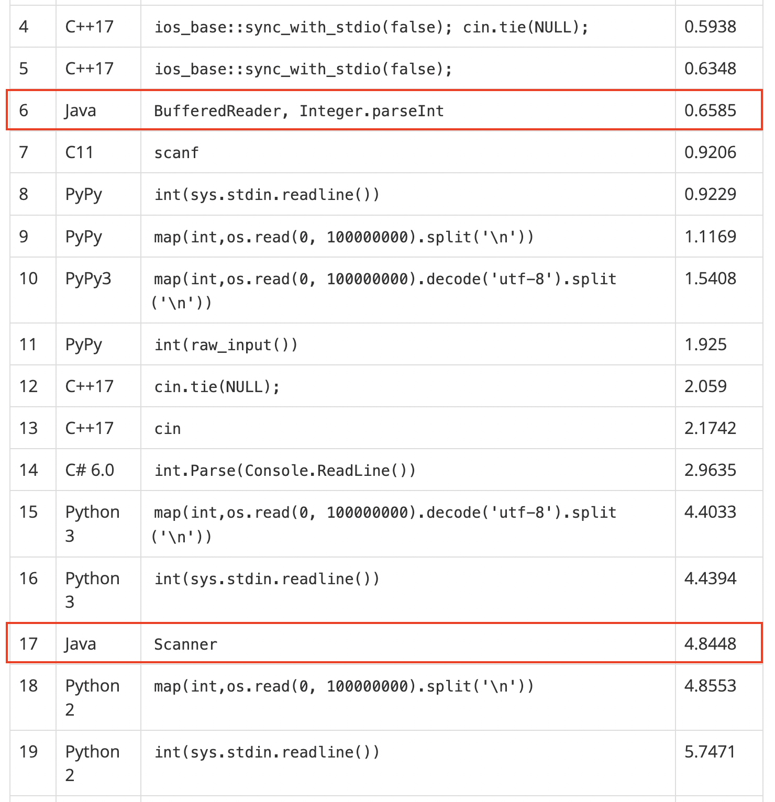

# 백준 Java 입출력

백준이나 codeforce를 풀다보면, **입출력의 속도**를 한 번쯤 고려하게 됩니다. 연산이 빠른 편에 속하는 언어인 `C`나 `C++`마저도 입출력 앞에선 느려지기 마련입니다. `Java` 역시 마찬가지인데, **입력을 받는 방식**에 따라 입출력 속도도 차이가 납니다. 아래 이미지를 보면, 같은 언어임에도 불구하고 **약 8배** 가량 차이가 나는 것을 확인 할 수 있습니다.

> [정수 10,000,000개가 적힌 파일을 입력받는데 걸리는 시간을 측정.](https://www.acmicpc.net/blog/view/56)
> 
> 
> 
> 

왜 `Scanner`와 `BufferedReader`사이에 이런 차이가 나는 지 한 번 알아보겠습니다.

## Java 입출력의 종류

자바의 모든 입출력은 **Stream**을 통해 이루어집니다. 입출력 장치는 매우 다양해서 장치마다 입출력 부분을 일일이 다 구현할 수 없습니다. 이런 문제를 해결하기 위해 `Java`에서는 일종의 **가상 통로인 Stream**을 제공하는 것입니다.


자바 Stream의 **이름**으로 입력용인지 출력용인지 구분이 가능합니다.

- **입력 스트림**: FileInput**Stream**, File**Reader**, BufferInput**Stream**, Buffer**Reader** 등
- **출력 스트림**: FileOutput**Stream**, File**Writer**, BufferOutput**Stream**, Buffer**Writer** 등

위의 볼드체를 보시면 **Stream**이나 **Reader**, **Writer**로 끝나는 것을 알 수 있는데 차이는 아래와 같습니다.

## Stream의 단위

원래 자바의 Stream은 Byte단위로 자료의 입출력이 이루어집니다. 대부분의 파일은 바이트 단위로 읽거나 쓰면 됩니다. 하지만 `Java`에서 하나의 문자를 나타내는 char형은 `2Byte` 이기 때문에 바이트 단위로 읽으면 **한글같은 문자는 깨져버립니다.** 따라서 문자용 스트림을 따로 제공하는데, 여기서 이름의 차이가 발생합니다.

- **Stream**으로 끝나는 이름은 **바이트 단위**를 처리하는 Stream 클래스
- **Reader나 Writer**로 끝나는 이름은 **문자**를 위한 Stream 클래스
    
    
    

> `Java`에선 char형이 **ASCII가 아닌 Unicode**를 사용하므로 **`2바이트`**를 할당합니다!
> 

## 표준 입출력

이제 우리는 이름에서 해당 Stream이 **어떤 데이터(byte, char)를 담는 지** 알 수 있게 됐습니다. 그렇다면 Java에서 흔히 쓰는 **표준 입출력**으로 불리는 `System.out`, `System.in`에 대해 알아보겠습니다.

> **표준? 모니터, 키보드를 말하는건가?**
어떤 프로그램이든 어떤 ‘입력'을 받으면 어떤 ‘출력'을 내놓게 됩니다. 리눅스에선 이를 `/dev` 디렉토리에 표준 입출력 **stream을 파일형태**로 담고 있습니다. 실제로 안을 열어보면 `stdin`, `stdout`이 들어 있는 것을 확인 할 수 있습니다.
> 
> 
> 
> 
> **표준**이란 결국 추상화 된 입출력 장치를 의미합니다. 유닉스에선 따로 명시되지 않는 한 **부모 프로세스로 부터 표준 입출력 대상을 상속 받습니다.** 기본적으로 키보드로부터 표준 입력을 받고, 쉘(콘솔)로 표준 출력을 보내기 때문에 표준 입출력은 대부분 키보드, 쉘이라고 생각하시면 됩니다.
> 
> 출처: [https://shoark7.github.io/programming/knowledge/what-is-standard-stream](https://shoark7.github.io/programming/knowledge/what-is-standard-stream)
> 

`System Class`는 아래와 같이 3개의 변수를 가지고 있습니다.

| 자료형 | 변수 이름 | 설명 |
| --- | --- | --- |
| static PrintStream | out | 표준 출력 스트림 |
| static InputStream | in | 표준 입력 스트림 |
| static OutputStream | err | 표준 오류 출력 스트림 |

System 클래스는 내부적으로 Stream을 사용하고 있음을 확인할 수 있습니다. 따라서 한 번에 한 바이트만 입력을 받을 수 있기 때문에 **한글은 입력받을 수 없습니다.**

### *예시*

```java
import java.io.IOException;

public class Main {

  public static void main(String[] args) {
    System.out.println("System.in 테스트");
    // write your code here
    int i;
    try {
      i = System.in.read();
      System.out.println(i);
      System.out.println((char) i);
    } catch (IOException e) {
      System.out.println(e);
    }
  }
}
```


## 백준 입력 Scanner vs BufferedReader

두 클래스 모두 버퍼를 가지고 있다는 특징이 있습니다. 최대 Buffer의 크기만큼 데이터를 받아와서 한 번에 출력함으로써 입출력 속도를 빠르게 합니다. 여기서 각각의 특징에 대해 알아보겠습니다.

### Scanner

1. `java.util` 패키지내에 위치하고 있습니다
2. 버퍼의 사이즈가 `**1024byte**` 입니다.
3. 데이터를 파싱해서 **원하는 type**으로 가져옵니다
4. `I/O Exception`을 던지지 않습니다.
5. **thread unsafe** 합니다.

### BufferedReader

1. `java.io` 패키지내에 위치하고 있습니다.
2. 버퍼의 사이즈가 `**8192byte`** 입니다.
3. 데이터를 파싱하지 않은 채 가져옵니다
    - String으로만 읽고 저장합니다.
4. `I/O Exception`을 던집니다.
5. **thread safe** 합니다.

### 결론

1. `Scanner`와 `BufferdReader`의 버퍼 사이즈가 약 8배 차이가 납니다.
2. `BufferdReader`는 많은 입력에 대해 빠르지만 별도의 형변환이 필요합니다.

## 번외) [빠른 A+B](https://www.acmicpc.net/problem/15552)

많은 입출력이 있을 때 속도를 확인할 수 있는 코드입니다.

### Scanner + System.out

```java
import java.util.Scanner;
import java.util.stream.IntStream;

public class Main {

  public static void main(String[] args) {
    Scanner sc = new Scanner(System.in);
    int T = sc.nextInt();
    IntStream.range(0, T).forEach(i -> {
      int A = sc.nextInt();
      int B = sc.nextInt();
      System.out.println(A + B);
    });
  }
}
```


### BufferedReader + Writer

```java
import java.io.BufferedReader;
import java.io.BufferedWriter;
import java.io.IOException;
import java.io.InputStreamReader;
import java.io.OutputStreamWriter;

public class Main {

  public static void main(String[] args) throws IOException {
    BufferedReader br = new BufferedReader(new InputStreamReader(System.in));
    BufferedWriter bw = new BufferedWriter(new OutputStreamWriter(System.out));

    int T = Integer.parseInt(br.readLine());
    for (int t = 0; t < T; t++) {
      String[] inputStrArr = br.readLine().split(" ");
      int A = Integer.parseInt(inputStrArr[0]);
      int B = Integer.parseInt(inputStrArr[1]);

      bw.write(A + B + "\n");
    }
    bw.flush();
    br.close();
    bw.close();
  }
}
```


### Ref.

- [https://www.acmicpc.net/blog/view/56](https://www.acmicpc.net/blog/view/56)

- [https://montoo.tistory.com/entry/JAVA-Basic-자바-입출력](https://montoo.tistory.com/entry/JAVA-Basic-%EC%9E%90%EB%B0%94-%EC%9E%85%EC%B6%9C%EB%A0%A5)

- [https://shs2810.tistory.com/19](https://shs2810.tistory.com/19)