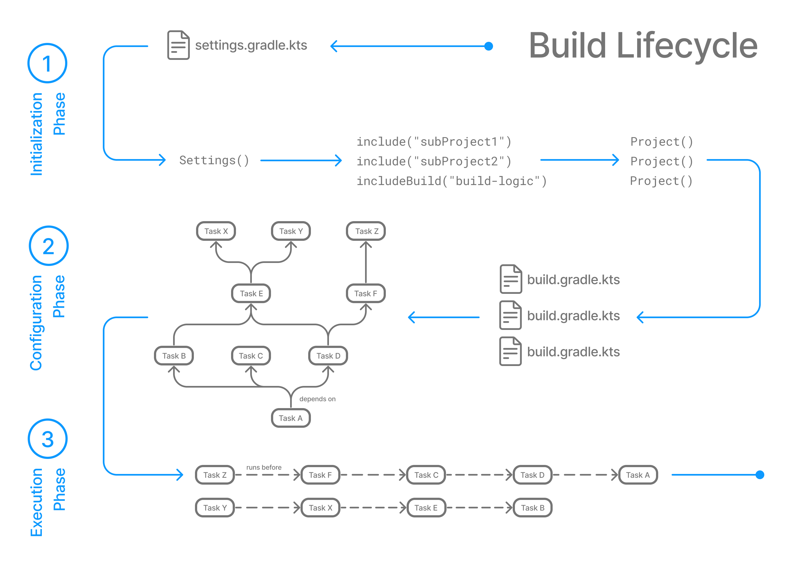

gradle 빌드는 task 간의 종속성을 정의할 수 있습니다.

종속성을 정의하면 gradle은 종속성 그래프를 구성하는데, 이 그래프를 토대로 gradle은 작업 순서를 결정합니다.

## Task Graphs

gradle은 작업을 실행하기 전에 아래와 같은 작업 그래프를 작성합니다.

이 작업 그래프를 토대로 작업간의 종속성을 확인할 수 있습니다.


## Build Phases

gradle build는 아래와 같이 3개의 phase로 이루어집니다.


### Phase 1. Initialization

초기화 단계에선 `settings.gradle(.kts)` 파일을 감지합니다.

이 파일을 기반으로 `Setting` 인스턴스를 만듭니다.

설정 파일을 참고해 빌드를 구성할 프로젝트들을 결정합니다.

결정된 모든 프로젝트에 대해 `Project` 인스턴스를 만듭니다.

### Phase 2. Configuration

빌드에 참여하는 모든 프로젝트의 빌드 스크립트인 `build.gradle(.kts)`를 참고해 요청된 작업에 대한 작업 그래프를 만듭니다.

### Phase 3. Execution

작업을 실행하는 단계입니다. 이 때 작업은 병렬로 실행될 수 있습니다.



### Example

`settings.gradle`

```groovy
rootProject.name = 'basic'
println 'This is executed during the initialization phase.'
```

`build.gradle`

```groovy
println 'This is executed during the configuration phase.'

tasks.register('configured') {
    println 'This is also executed during the configuration phase, because :configured is used in the build.'
}

tasks.register('test') {
    doLast {
        println 'This is executed during the execution phase.'
    }
	println 'This is executed during the configuration phase as well, because :test is used in the build.'
}

tasks.register('testBoth') {
	doFirst {
	  println 'This is executed first during the execution phase.'
	}
	doLast {
	  println 'This is executed last during the execution phase.'
	}
	println 'This is executed during the configuration phase as well, because :testBoth is used in the build.'
}
```

위 파일들을 이용해  `gradle test testBoth`를 수행하면 아래와 같은 결과를 얻을 수 있습니다.

이 때 `configured` task는 요청된 작업이 아니므로 구성에 포함되지 않습니다.

```bash
> gradle test testBoth
This is executed during the initialization phase.

> Configure project :
This is executed during the configuration phase.
This is executed during the configuration phase as well, because :test is used in the build.
This is executed during the configuration phase as well, because :testBoth is used in the build.

> Task :test
This is executed during the execution phase.

> Task :testBoth
This is executed first during the execution phase.
This is executed last during the execution phase.

BUILD SUCCESSFUL in 0s
2 actionable tasks: 2 executed
```

## 참고

[https://docs.gradle.org/current/userguide/build_lifecycle.html](https://docs.gradle.org/current/userguide/build_lifecycle.html)