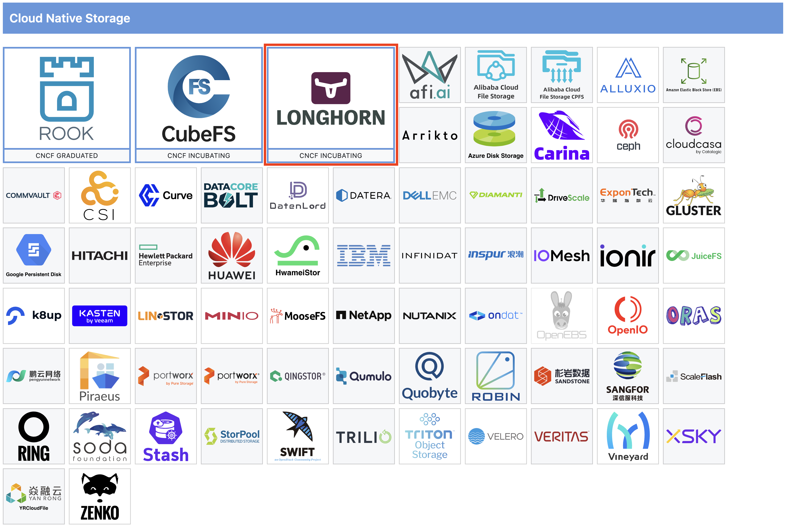
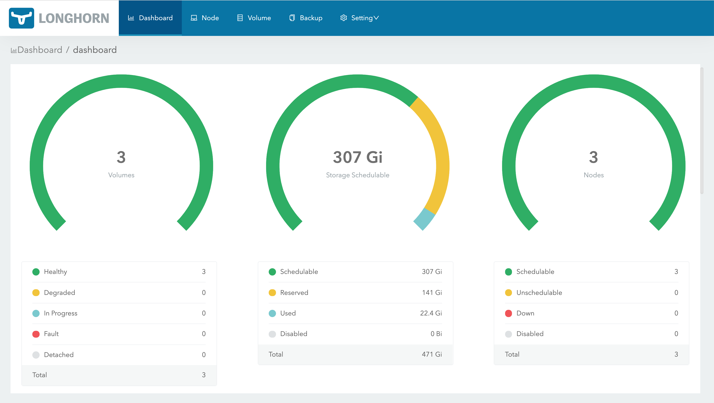
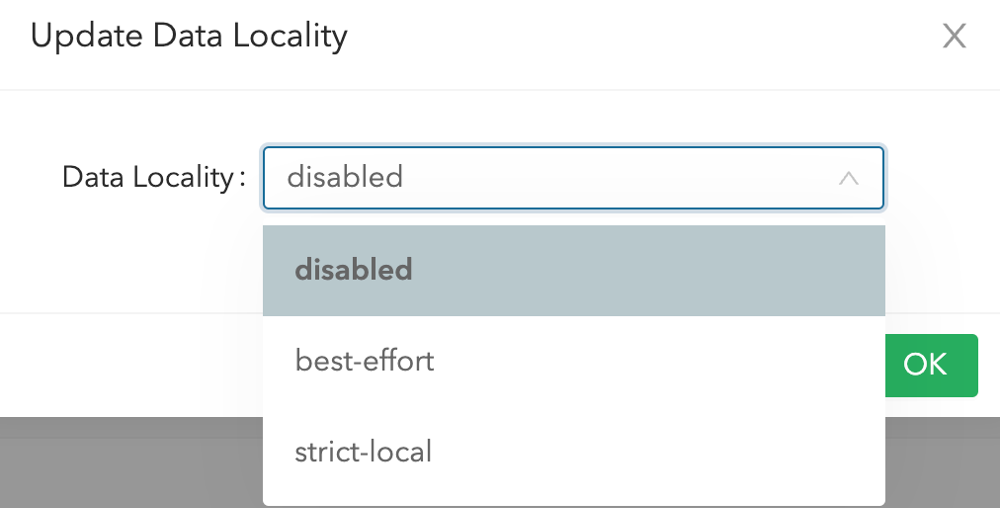

# 서론

k8s를 쓰다보면 가끔 HDD나 SSD 같은 보조 저장소(볼륨)를 사용해야 할 일이 있습니다.

하지만 데이터 저장을 위해 노드의 볼륨을 직접 사용하는건 k8s의 *"모든 인프라를 추상화하여 애플리케이션 개발자가 신경쓰지 않도록 한다"* 는 철칙에 반하는 내용입니다. k8s는 **"개발자에게 어떤 노드가 몇 대 떠 있는진 신경쓰지 않게 해줘야**" 하기 때문입니다.

### 볼륨 추상화의 어려움

k8s에선 cpu와 memory는 아래와 같이 쉽게 추상화 할 수 있습니다.

```yaml
resources:
  requests:
    memory: "64Mi"
    cpu: "250m"
  limits:
    memory: "128Mi"
    cpu: "500m"
```

하지만 볼륨은 쉽게 추상화 하기 어려운데요.

그 이유는 cpu와 memory는 상태가 없어서 파드가 어떤 노드에 뜨더라도 상관없지만, 볼륨은 데이터를 저장하고 유지해야 하기 때문에 파드가 뜨는 노드에 종속적이기 때문입니다. (이를 상태를 가진다고 표현합니다)

 그래서 파드가 죽었다가 다른 노드에 다시 뜨면 기존의 볼륨은 사라진다고 볼 수 있습니다.

### PV / PVC

그래서 k8s는 볼륨을 추상화 하기 위해 PV와 PVC라는 리소스를 제공하는데요.

**PV(PersistentVolume)는 볼륨 그 자체를 의미하고 PVC(PersistentVolumeClaim)는 사용자가 PV에 하는 요청**입니다.

아래 이미지처럼 실제 외부 Storage가 있고, Storage에서 추상화 된 볼륨인 PV를 만들어 주면 PVC가 PV와 pod를 연결해주는 방식입니다

 간단하게 **PV는 관리자**가 생성하는 리소스이고, **PVC는 사용자(개발자)** 가 생성하는 리소스입니다. 


출처: [https://kimjingo.tistory.com/153](https://kimjingo.tistory.com/153)

## 외부 Storage가 없다면?

위에서 봤듯 볼륨을 추상화하려면 외부 Storage가 있어야 합니다.

만약 외부 Storage가 없거나, 너무 느리다면 다음 대안으로 생각해 볼 수 있는 볼륨은 노드의 볼륨입니다.

- 흔히들 hostPath로 연결해 사용하는 그 방식입니다.

노드의 볼륨을 사용할 수만 있다면 노드의 **놀고 있는 디스크 자원**을 최대한 뽑아 쓸 수 있습니다.

### 다시 원점

하지만 처음에 언급했듯이 **볼륨은 파드가 뜨는 노드에 종속적**이라는 문제가 있습니다. 위 방식을 사용하려면 노드와 파드를 항상 1:1로 매핑시켜야 하는 문제가 있습니다.

이는 **노드의 존재를 개발자가 알아야 하기 때문에** 좋지 않은 설계라고 볼 수 있습니다.

이를 해결하기 위해 나온 오픈 소스 중 하나인 **Longhorn**이 이번에 제가 소개할 오픈소스입니다.

# Longhorn

Longhorn은 CNCF에서 지원을 받고 있는 오픈소스 중 하나로 아래와 같이 Cloud Native Storage 분야에서 단단한 입지를 지니고 있습니다.



출처: [https://landscape.cncf.io](https://landscape.cncf.io/)

2014년에 오픈소스 프로젝트로 시작했고, 많은 개선을 거쳐 지금까지 발전한 longhorn은 아직 **INCUBATING** 단계이지만 사용성이나 원리만으로 설명할 가치가 충분하다 생각해 포스팅 하기로 했습니다.

> CNCF 프로젝트 성숙도 래벨
> 
> 
> 
> 
> 출처: [https://www.cncf.io/project-metrics/](https://www.cncf.io/project-metrics/)
> 

## Longhorn 원리

롱혼은 그럼 어떤 원리로 위의 문제들을 해결하는지 살펴보겠습니다.

롱혼은 아래와 같이 저장할 데이터를 동기식으로 복제해 여러 물리 디스크에 저장하는 방식을 사용합니다.

이 원리로 외부 스토리지 없이 노드의 유휴 디스크를 사용할 수 있어서 **"노드의 놀고 있는 디스크 자원을 최대한 뽑아 쓸 수"** 있습니다. 


그리고 Longhorn은 대표적인 Block Storage 입니다.

Block Storage란 데이터를 가져와 동일한 크기의 블록으로 나누고 블록 스토리지 시스템이 빠르고 검색에 최적화 된 방식으로 물리 스토리지에 데이터 블록을 저장하는 기법을 말합니다.

다른 개념으론 File Storage가 있는데, NFS, SMB가 그 예시입니다.

참고: [https://aws.amazon.com/ko/what-is/block-storage/](https://aws.amazon.com/ko/what-is/block-storage/)

## Getting Started

### 설치

longhorn은 kubectl, helm, argoCD 등 다양한 방법의 설치를 지원하는데 여기선 helm으로 설치하는 방법을 알아보겠습니다.

```yaml
helm repo add longhorn https://charts.longhorn.io
helm repo update

helm install longhorn longhorn/longhorn --namespace longhorn-system --create-namespace --version 1.6.0
```

위와 같이 **helm**을 설치만 하면 간단하게 사용할 수 있습니다.

- 이 글을 작성하는 시점의 longhorn 버전은 1.6.0 입니다.

참고: [https://longhorn.io/docs/1.6.0/deploy/install/install-with-helm/](https://longhorn.io/docs/1.6.0/deploy/install/install-with-helm/)

> ⚠️주의: 지원하는 OS와 k8s 버전은 아래와 같습니다. 이전 버전이나 이후 버전은 지원하지 않을 수 있습니다.
> 
> 
> 
> 
> 
> 
> 그 외에 주의해야 할 점은 여길 참고하시면 됩니다. [https://longhorn.io/docs/1.6.0/best-practices/](https://longhorn.io/docs/1.6.0/best-practices/)
> 

### Web UI

longhorn을 설치하면 자동으로 **longhorn-frontend** `pod`와 `service`를 함께 띄우는데, 이를 통해 web UI에 접근할 수 있습니다.



Web UI로 전체 대시보드도 쉽게 볼 수 있고, 볼륨 추가, **PV, PVC 추가**도 손 쉽게 할 수 있습니다.

볼륨을 추가하면 **롱혼이 알아서** 용량을 판단해 할당이 가능한 노드들에 볼륨을 할당해 줍니다.

각 볼륨들에 **replica 수**도 마음대로 설정할 수 있습니다.

또 사용중인 **볼륨의 정보**도 Web UI로 쉽게 확인이 가능합니다.


전체 볼륨 Size: 5 Gi


실제 사용중인 볼륨 Size: 147 Mi

또 longhorn **전체 설정**을 Web UI로 손쉽게 할 수 있는데, 이번에 소개할 설정은 바로 data locality(데이터 지역성) 설정입니다.



기본적으론 Data Locality 설정이 **disabled**이기 때문에 파드가 저장할 데이터는 볼륨의 위치와 무관하게 아무 노드에나 뜰 수 있습니다.

하지만 아래 `best-effort` 와 `strict-local` 을 이용하면 볼륨의 위치와 파드를 같은 노드에 위치시켜 로컬 복제본을 가짐으로써 더 빠른 데이터 접근이 가능해집니다.

그럼 바로 떠오르는 문제는 **파드의 가용성**일텐데요, *"파드가 뜰 수 있는 노드가 1대로 한정되어 있으면 그 노드가 죽으면 파드도 함께 죽는건가?"* 라는 의문이 드실 수 있습니다.

`strict-local`은 hostPath와 거의 동일하게 동작해 항상 replica = 1 로 고정해야 하는 설정입니다.

때문에 가용성에 문제가 되지만, `best-effort`를 사용하면 replica = N 일 때 데이터 복사본이 저장된 N대 중에 한 대에 뜨게 하는 설정입니다.

**그래서 데이터 복사본이 있는 N 대가 모두 죽지 않는 이상 파드에 문제가 생길 일은 없습니다.**

즉, 가용성을 포기하더라도 정말 빠른 데이터 접근을 원한다면 `strict-local` , 적당히 가용성도 챙기면서 약간의 성능도 챙기고 싶다면 `best-effort`를 사용하시면 됩니다.

둘 다 `longhorn`에서 노드와 파드 매칭을 관리해주기 때문에 **개발자가 어떤 파드가 어떤 노드에 떠야 하고 떴는 지는 신경 쓸 필요가 없습니다.**

참고: [https://longhorn.io/docs/1.6.0/high-availability/data-locality/](https://longhorn.io/docs/1.6.0/high-availability/data-locality/)

### 백업 및 복원

클러스터의 여러 노드에 데이터를 복제한다고 해도 데이터를 복제한 노드 전부가 죽을 가능성 역시 배제할 수 없습니다.

이럴 때를 위해 롱혼은 스냅샷 기능을 지원하는데, 외부 Storage(AWS S3, GCP Cloud Storage, NFS 등등)가 있다면 편하게 스냅샷을 여기에 저장했다가 다시 가져올 수 있습니다.

참고: [https://longhorn.io/docs/1.6.0/snapshots-and-backups/backup-and-restore/set-backup-target/](https://longhorn.io/docs/1.6.0/snapshots-and-backups/backup-and-restore/set-backup-target/)

## 단점

### 성능

2020년에 발표한 longhorn의 성능은 로컬 저장소에 비해 크게 떨어졌었습니다.


하지만 2024년에 롱혼 1.6.0이 나오면서 data Engine v2 (beta)가 발표됐는데요, 표를 보시면 로컬 저장소와 거의 차이가 나지 않음을 볼 수 있습니다. 


참고: [https://longhorn.io/blog/performance-scalability-report-aug-2020/](https://longhorn.io/blog/performance-scalability-report-aug-2020/)

참고2: [https://www.suse.com/c/rancher_blog/announcing-longhorn-1-6-0/](https://www.suse.com/c/rancher_blog/announcing-longhorn-1-6-0/)

### 유한한 스토리지

또 다른 단점은 노드들의 디스크 총합을 넘는 양의 볼륨은 사용할 수 없다는 점입니다.

거의 무한한 용량을 가진 외부 스토리지와 비교되는 단점이라고 볼 수 있습니다.

## 더 보기

더 많은 정보를 원하시면 아래 longhorn 공식 문서를 참고하시면 됩니다.

[https://longhorn.io/docs/1.6.0/what-is-longhorn/](https://longhorn.io/docs/1.6.0/what-is-longhorn/)