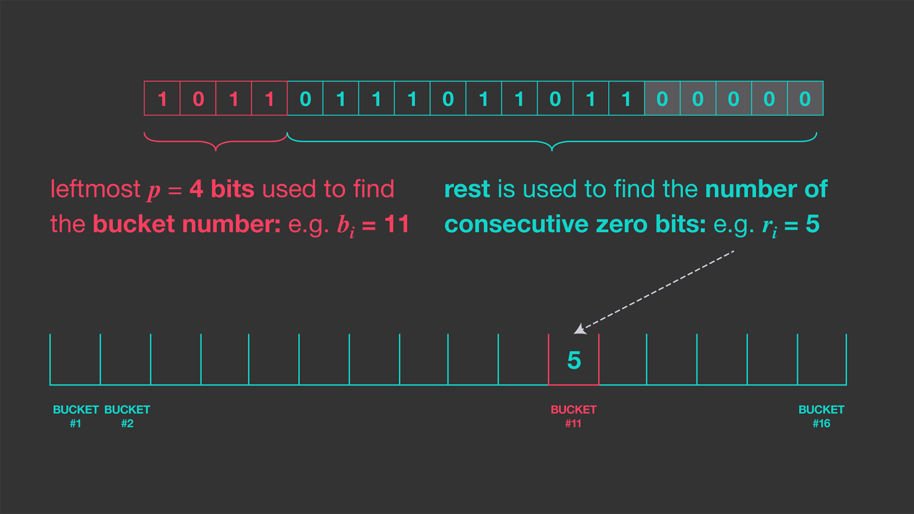

# Set으로 담기엔 너무 크다

가끔 어떤 데이터 집합의 unique 한 원소 개수를 구하고 싶을 때가 있습니다.

저의 경우는 지표를 얻기 위해서 였는데요, 간단한 예시로 **unique 한 하루 서비스 접속 사용자 수를 구한다고 해보겠습니다.**

가장 먼저 떠오르는 방법은 `Set`에 모든 사용자의 id를 넣는 건데, 이 때 사용자 id는 `int64` 타입이라고 하겠습니다.

실제로 unique 한 사용자 수가 1억명이라고 해보겠습니다.

**1억 * 8 byte = 0.8GB**

그렇게 큰 크기는 아니지만 지표를 위해 서버의 메모리를 800MB나 잡아먹는건 분명 낭비입니다.

심지어 이런 지표가 10개, 20개 ... 많아질수록 점점 **서버가 감당하기 힘들어 질 수 있구요.**

# 이를 위해 등장한 HyperLogLog

이런 문제를 해결할 수 있는 알고리즘이 있는데요, 바로 HyperLogLog 입니다.

HyperLogLog는 적은 바이트로 unique 한 원소 수를 **대략적으로** 구할 수 있는 알고리즘입니다.

아래는 셰익스피어 전 작품에 사용된 총 67,801개의 단어를 세는데 사용된 메모리를 비교한 표입니다.

적은 오차율에 비해 메모리 차이가 월등하게 나는 것을 알 수 있습니다.

| 방식 | 사용 메모리(바이트) | 유일한 단어 개수(결과) | 상대 오차 |
| --- | --- | --- | --- |
| HashSet | 10,447,016 | 67,801 | 0% |
| HyperLogLog | 512 | 70,002 | 3% |

출처: [https://highscalability.com/big-data-counting-how-to-count-a-billion-distinct-objects-us](https://highscalability.com/big-data-counting-how-to-count-a-billion-distinct-objects-us)

# 일단 HyperLogLog 사용해보기

마침 [java 라이브러리](https://github.com/aggregateknowledge/java-hll)중에 HyperLogLog를 구현해놓은게 있어서 한 번 성능을 테스트 해봤습니다.

사용한 코드는 아래와 같습니다.

```java
import java.util.stream.LongStream;
import net.agkn.hll.HLL;
import org.apache.curator.shaded.com.google.common.hash.HashFunction;
import org.apache.curator.shaded.com.google.common.hash.Hashing;
import org.junit.jupiter.api.Test;
import org.openjdk.jol.info.GraphLayout;
 
class HyperLogLogTest {
 
    @Test
    void test() {
        HashFunction hashFunction = Hashing.murmur3_128();
        long numberOfElements = 100_000_000; // 1억
        HLL hll = new HLL(14, 5);
        System.out.println("hll size before add data: " + GraphLayout.parseInstance(hll).toFootprint());
        var totalStartTime = System.nanoTime();
        LongStream.range(0, numberOfElements).forEach(element -> {
                    var startTime = System.nanoTime();
                    long hashedValue = hashFunction.newHasher().putLong(element).hash().asLong();
                    hll.addRaw(hashedValue);
                    if (element == 0 || element == 25_000_000 || element == 50_000_000|| element == 75_000_000 || element == 99_999_999) {
                        System.out.println("element: {" + element + "}");
                        System.out.println("time: " + ((System.nanoTime() - startTime) / 1_000_000.0) + "ms");
                    }
                }
        );
        System.out.println();
        System.out.println("total time: " + ((System.nanoTime() - totalStartTime) / 1_000_000.0) + "ms");
        System.out.println("hll size after add data: " + GraphLayout.parseInstance(hll).toFootprint());
        System.out.println("hll.cardinality() = " + hll.cardinality());
    }
}
```

- 사용한 해시 함수: MurMur3_128
- 테스트 환경: Apple M1 Max 32GB RAM
- HLL 설정: log2m: 14, regwidth: 5

1억개의 서로 다른 숫자 데이터를 넣을 때 걸린 시간과 HLL의 메모리 사용량은 아래와 같았습니다.


오차율은 0.6%정도 였습니다.

> HyperLogLog 논문에서 상대 오차가 1.03906/√M 이라고 밝히고 있는데, 테스트 환경에서 M이 2^14 이라 이론상 오차율은 1%미만이다.
> 


특정 순간 hll에 원소를 추가할 때 걸리는 시간은 대부분 1ms 이내였습니다.

> 그런데 전체 걸린 시간이 6.6초 정도라 1억으로 나누면 개당 0.00066ms인 놀라운 현상...

# HyperLogLog 동작 원리

## Naver D2

이 쯤 되면 HyperLogLog가 정확히 어떤 원리로 저런 결과를 도출하는 지 궁금하실텐데요.

[naver D2](https://d2.naver.com/helloworld/711301)에선 아래와 같이 HyperLogLog를 설명하고 있습니다.


> *"수식이 있어 다소 복잡해 보이지만 알고리즘을 이해하는 것은 그리 어렵지 않다."* 라는 말과 함께요...

안타깝게도 저에겐 너무 어려웠기 때문에 그림으로 잘 설명이 되어 있는 다른 자료를 가져왔습니다.

## Meta

출처: [https://engineering.fb.com/2018/12/13/data-infrastructure/hyperloglog/](https://engineering.fb.com/2018/12/13/data-infrastructure/hyperloglog/)

이 자료에선 유일한 원소 개수를 찾는 알고리즘을 한 단계 한 단계 발전시켜 나가면서 최종적으로 HyperLogLog에 도달하는 과정을 보여주고 있습니다.

자료만으론 수학에 약한 제가 이해하기 어려워 개인적으로 정보를 더 추가해 봤습니다.

### 1. 균등 분포 해시 사용


먼저 가장 첫 step의 핵심은 **"균등하게 분포되는 해시 함수"** 입니다.

만약 **0~1 사이에 완전히 균등하게 값이 저장되는 해시 함수가 있다고 가정**하면 단순히 가장 작은 값을 분모로 두면 유일한 원소 개수가 됩니다.

왜냐면 n개의 원소가 0 ~ 1 사이에 균등하게 분포된다면 가장 작은 값은 `1/n` 일 것이기 때문이고, 이 값을 분모로 두면 `1/1/n = n` 이 됩니다.


하지만 이건 **"완전히 균등한 해시 함수"** 에 의존하는 방식이라 현실에선 오차율이 클 수 밖에 없습니다.

### 2. 확률적 계산


그래서 다음으로 나온 방식이 해시 함수에서 나온 값의 마지막 0의 개수를 세서 **확률적으로** 카디널리티를 구하는 방식입니다.

아래 그림과 같이 맨 오른쪽에서 **연속적으로 나오는 0의 개수**를 세면 곧 카디널리티가 됩니다.


완전히 **확률에 의존한** 값이기 때문에 만약 원소가 1개만 들어갔는데 마침 그 원소가 해시 함수에서 `1000 0000`이란 값으로 나왔다면, 카디널리티를 `2^7 = 128개` 로 오인할 수 있는 것입니다.

또 카디널리티가 항상 2의 n승 개로만 얻을 수 있다는 점도 단점입니다.

대신 카디널리티를 위해 저장해야 할 메모리가 매우 작다는 장점이 있습니다.

만약 32bit인 원소의 카디널리티를 저장하려면 0의 최대 길이인 5bit만 가지고 있으면 됩니다.

### 3. 정확성을 올린 LogLog

**확률에 의존한 방법**이기 때문에 정확성을 올리려면 여러번 해시 함수를 수행하고 평균을 낼 수도 있습니다.

이를 위해 하나의 해시 함수만 사용하는게 아니라 여러개를 사용할 수도 있습니다.


하지만 여러 해시 함수를 사용하면 계산 비용이 증가한다는 단점이 생깁니다.

이 문제를 해결하기 위해 하나의 해시 함수를 사용하되, **여러 버킷**을 사용하는 방식이 등장했습니다.



버킷을 이용해 서로 다른 해시 함수가 있는 것 처럼 시뮬레이션이 가능해졌습니다.

이를 **확률적 평균**이라고 합니다.

여기서 더 나아가 `Durand`와 `Flajolet`이 이 방식으로 통계 분석을 해보니 **0.79402** 라는 상수를 곱하면 편향을 수정해준다는 것을 알아냈습니다.

이 방식을 사용하면 `5bit`인 `2048`개 버킷을 사용했을 때 약 **2.8%** 의 오류를 예상할 수 있다고 합니다.

메모리도 **2048(버킷 수) * 5(비트) = 1.2KB**의 메모리만 필요하다는 것을 알 수 있습니다.

### 4. 정확성을 더 올린 HyperLogLog

`LogLog`도 꽤 좋은 추정기였지만 두 가지 추가 개선 사항을 통해 더 나은 결과를 얻어낼 수 있었습니다.

1. `Durand`와 `Flajolet`은 극 값의 이상치가 정확도를 크게 감소시키는걸 발견했고, 이를 위해 극 값은 버리고 70%만 유지해 평균화하는 방식을 택했습니다.
    - 이를 `SuperLogLog`라고 한다.
2. HLL은 **기하 평균 대신 조화 평균**을 사용해 오류를 약간 더 낮출 수 있었습니다.

버킷의 개수를 m개라고 했을 때 오차율은 약 `1.04 / /√M` 이라고 합니다.

M이 1024정도만 돼도 오차율이 3%정도 밖에 나지 않음을 알 수 있습니다.

## 결론

HyperLogLog는 redis에서도 지원해준다고 합니다.

간단한 지표를 뽑을 때, 그리고 정확한 값이 아니라 대략적인 값이 필요하다면 HyperLogLog를 사용해보는 것도 좋을 것 같습니다.
