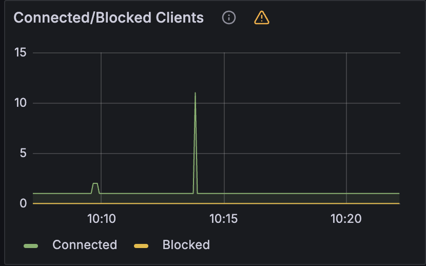

## Lettuce란?

Lettuce는 Java에서 사용하는 **redis client 라이브러리** 중 하나입니다.

> 다른 대표적인 redis client 라이브러리로 Jedis가 있는데, 둘의 성능 차이는 아래 블로그에서 잘 비교해뒀습니다.
>
> https://jojoldu.tistory.com/418

Lettuce는 **netty와 reactor를 기반**으로 하는 확장 가능한 스레드 안전 redis 클라이언트 입니다.

Lettuce는 크게 `sync`, `async`, `reactive` 3가지 모드를 지원하는데 오늘 알아볼 모드는 `async` 입니다.

## Lettuce async

Lettuce에서 제공하는 async API를 사용하면 **기존 로직의 흐름을 방해하지 않고** 레디스에 명령을 보낼 수 있습니다.

> ⚠️ 주의. Lettuce async 커넥션은 redis에서 에러를 응답해도 exception을 던지지 않습니다!
>
> "Asynchronous connections do not throw exceptions when Redis responds with an error."

### 사용법

사용법은 아래와 같이 RedisClient를 만들고 connection을 가져와서 명령어를 사용하기만 하면 됩니다.

```java
try (RedisClient redisClient = RedisClient.create("redis://localhost:6379");
     StatefulRedisConnection<String, String> connect = redisClient.connect()) {
    connect.async().set("test", "yoyo");
    connect.async().get("test")
            .whenComplete((result, exception) -> System.out.println(result));
            // yoyo

    Thread.sleep(15000);
}
```

여기서 주의할 점은 `connect()` 메서드를 호출하면 **항상 새로운 커넥션**이 생긴다는 것입니다.

```java
for (int i = 0; i < 10; i++) {
    StatefulRedisConnection<String, String> connect = redisClient.connect();
}
```



redis는 단일 스레드라 **커넥션이 많아진다고 해서 명령이 빨리 수행되는게 아니기 때문에** 커넥션은 하나만 만들어두고 사용하는게 좋습니다.

### aysnc에 사용되는 스레드

비동기로 redis 명령어를 보내려면 어딘가에선 명령을 수행해주어야 합니다.

이를 위해 Lettuce는 계산 작업에 `Runtime.getRuntime().availableProcessors() * 3`의 스레드를 default로 등록해둡니다.

그리고 모든 I/O 연산에도 `Runtime.getRuntime().availableProcessors() * 3`의 스레드를 default로 등록해둡니다.

> 이건 추측인데, redis에 요청을 보내고 받는 네트워크 작업은 I/O 스레드가, 그 외에 모든 연산은 계산 스레드가 하는 것 같습니다.

## 주의 해야 할 점

### eventloop blocking

Lettuce의 future는 netty의 EventLoop에서 수행이 됩니다.

eventLoop를 blocking 하는 건 좋지 않은 선택이기 때문에 혹여나 redis에서 응답을 받아서 장기 처리를 할 일이 있다면 `thenAccept()` 보단 `thenAcceptAsync()`를 활용해 또 다른 스레드로 빼는게 좋습니다.

아래는 좋지 않은 예시입니다.

이벤트 루프를 블락해 다른 명령어들까지 동작을 지연시키고 있습니다. 아래 로직은 **100초가 지나야 끝납니다.**

```java
for (int i = 0; i < 100; i++) {
    int finalI = i;
    connect.async().get("test")
            .thenAccept((result) -> {
                System.out.println(Thread.currentThread().getName() + " done! " + finalI);
                try {
                    Thread.sleep(1000);
                } catch (InterruptedException e) {
                    throw new RuntimeException(e);
                }
            });
}

// lettuce-nioEventLoop-4-1 done! 0
// lettuce-nioEventLoop-4-1 done! 1
// lettuce-nioEventLoop-4-1 done! 2
// lettuce-nioEventLoop-4-1 done! 3
// lettuce-nioEventLoop-4-1 done! 4
// ...
```

좋은 예시입니다. 이벤트 루프를 블락하지 않고 별도의 스레드로 이후 로직을 진행하기 때문에 이벤트 루프는 방해받지 않습니다.

아래 로직은 대략 **1초후에 종료됩니다.**

```java
ExecutorService executorService = Executors.newFixedThreadPool(100);
for (int i = 0; i < 100; i++) {
    connect.async().get("test")
            .thenAcceptAsync((result) -> {
                System.out.println(Thread.currentThread().getName() + " done!");
                try {
                    Thread.sleep(1000);
                } catch (InterruptedException e) {
                    throw new RuntimeException(e);
                }
            }, executorService);
}
```

> `...async()` 메서드의 경우 스레드를 지정해주지 않으면 default 스레드로 `ForkJoinPool.commonPool()`을 사용합니다.

## options

몇 가지 유용한 옵션도 알아보려 합니다.

```java
public RedisClient getRedisClient() {
    RedisClient redisClient = RedisClient.create("redis://localhost:6379");
    redisClient.setOptions(ClientOptions.builder()
            .requestQueueSize(100) // 이벤트 루프가 바쁠 때 queue에 넣고 대기합니다. 만약 queue가 가득 찼다면 exception을 던지고 요청을 무시합니다.
            .timeoutOptions(TimeoutOptions.enabled(Duration.ofNanos(1))) // command의 timeout 값을 설정합니다.
            .build()
    );
    return redisClient;
}
```

### requestQueueSize

eventloop에 들어가기 전 큐에 요청을 쌓아둘 수 있는데요, **그럼 eventloop가 바쁘더라도** 일단 queue에 넣기 때문에 **전체 로직에 영향은 줄일 수 있습니다.**

아래는 앞서 봤던 eventloop를 블락킹하는 코드입니다. 하지만 `requestQueueSize`를 **100**으로 설정해뒀기 때문에 메인 로직은 막히는 것 없이 바로 완료되는 모습입니다.

```java
for (int i = 0; i < 100; i++) {
    int finalI = i;
    connect.async().set("test", "async")
        .whenComplete((result, exception) -> {
            System.out.println("done! = " + finalI);
            System.out.println("exception = " + exception);
            try {
                Thread.sleep(500);
            } catch (InterruptedException e) {
                throw new RuntimeException(e);
            }
        });
}

System.out.println("queue insert done!!");
```

```
queue insert done!!
done! = 0
exception = null
done! = 1
exception = null
done! = 2
exception = null
done! = 3
exception = null
```

만약 큐가 가득 찼다면 아래와 같은 exception을 던지면서 command를 무시해버립니다.

```
io.lettuce.core.RedisException: Request queue size exceeded: 100. Commands are not accepted until the queue size drops.
```

### timeoutOptions

command의 timeout 값을 설정할 수 있습니다. 여기서 주의해야 할 점은, **sync, async 구분 없이 모두 timeout 설정이 된다는 점입니다.**

다만 async의 경우 exception을 외부까지 가져오지 않기 때문에 **exception을 무시**해버립니다.

때문에 에러 로깅을 하고 싶다면 앞서 봤던 `.whenCompleteAsync()` 같은 메서드를 사용해 exception을 잡아야 합니다. 

## 참고

https://lettuce.io/core/release/reference/index.html
