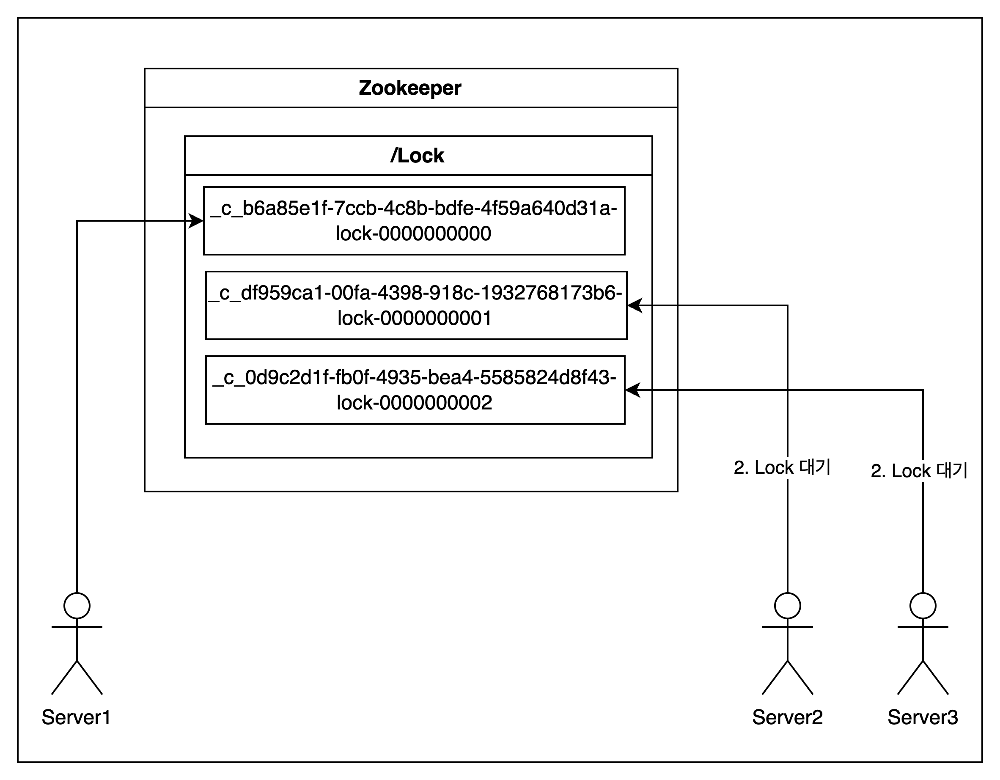

이번 포스팅에서는 [zookeeper 기초편](https://gusah009.github.io/etc/2024-03-24-zookeeper%20recipe/)에 이어서 주키퍼에서 제공하는 핵심 기능들을 더 살펴보겠습니다.

기능들의 원리들과 로직의 구현체인 `curator`에선 어떻게 구현했고, 실제로 어떻게 동작하는지 살펴보겠습니다.

## Locks

분산 시스템에선 **전역적인 Lock**을 잡는 일은 많이 필요로 하지만 쉽지는 않은 작업입니다.

> 전역적인 Lock을 분산 락 (Distributed Lock) 이라고도 부릅니다.

하지만 주키퍼를 이용하면 쉽게 분산 락을 구현할 수 있습니다. 그 과정은 아래와 같습니다.

1. `/lock` 이라는 경로명과 함께 sequence & ephermeral flag로 세팅해 경로를 만듭니다.

> Sequence Nodes: 경로의 끝에 일정하게 증가하는 카운터가 추가 됨.
>
> ex. /svc/nodes0000000001,/svc/nodes0000000002
>
> Ephemeral Nodes: 세션이 유지되는 동안 활성(세션이 종료되면 삭제됨), 자식 노드를 가질 수 없음
>
> 참고: https://andro-jinu.tistory.com/entry/zookeeper2

2. 잠금을 획득할 노드에서 `getChildren()`을 호출합니다. (이 때 watch는 설정하지 않습니다.)

3. 만약 1단계에서 생성한 경로명의 시퀀스 번호 접미사가 가장 낮으면 클라이언트가 잠금을 갖게 되고 작업을 수행하면 됩니다.

4. 클라이언트는 다음으로 낮은 시퀀스 번호의 잠금 디렉터리 경로에 감시 플래그를 설정하여 `exists()`를 호출합니다.

5. `exists()`가 null을 반환하면 2단계로 이동합니다. 그렇지 않으면 2단계로 이동하기 전에 이전 단계의 경로 이름에 대한 알림을 기다립니다.

### 그림으로 보기

그림으로 보면 아래와 같습니다.

### curator를 사용한 Lock 예시

curator를 사용해 Lock을 구현한 사용성 예시입니다.

https://github.com/gusah009/zookeeper-recipe/blob/main/zk-recipe/src/test/kotlin/org/example/zkrecipe/LockTest.kt

### zookeeper를 이용한 분산 락이 좋은 이유

만약 고가용성이 필요하지 않다면 이런 분산 락은 redis를 이용해 구현할 수도 있습니다.

redis는 기본적으로 단일 스레드이기 때문에 **직렬적으로 명령을 수행할 수 있어서** 반드시 한 번에 하나의 서버만 락을 가질 수 있음을 보장할 수 있습니다.

하지만 고가용성을 보장하진 못하는데요, 이를 위해 [RedLock](https://redis.io/docs/latest/develop/use/patterns/distributed-locks/)이라는 대체제도 나온 것으로 보이지만 아직 부족해보입니다.

> https://martin.kleppmann.com/2016/02/08/how-to-do-distributed-locking.html
>
>  think the Redlock algorithm is a poor choice because it is “neither fish nor fowl”: it is unnecessarily heavyweight and expensive for efficiency-optimization locks, but it is not sufficiently safe for situations in which correctness depends on the lock.
>
> Redlock 알고리즘은 "물고기도 새도 아닌" 알고리즘으로 효율성 최적화 잠금에는 불필요하게 무겁고 비용이 많이 들지만 잠금에 따라 정확성이 좌우되는 상황에서는 충분히 안전하지 않기 때문에 잘못된 선택이라고 생각합니다.

그에 반해 주키퍼는 합의 알고리즘을 기반으로 **고가용성을 보장**하면서도 락을 보장할 수 있습니다.

## Leader Election

리더 선출도 분산 시스템에서 중요한 기능 중 하나입니다.

가령 단일 리더 DB에서는 리더만 쓰기를 허용하고 나머지는 읽기만 가능하게 하는 기능을 사용할 수도 있습니다.

주키퍼에선 이런 리더 선출을 아주 쉽게 사용할 수 있는데요, 바로 `SEQUENCE-EPHEMERAL` 노드를 생성해 그 중 가장 낮은 번호를 가진 노드를 리더로 설정하는 것입니다.

하지만 리더 선출은 단순히 리더를 선출하는 것 뿐만 아니라 리더가 죽었을 때 새로운 리더를 선출하는 것도 중요합니다.

지금부턴 어떻게 주키퍼에서 리더가 죽었을 때 새로운 리더를 선출하는 지 알아보겠습니다.

1. `/Election` 이라는 경로에 `SEQUENCE-EPHEMERAL` 플래그를 사용해 노드들을 생성합니다.
2. 여기서 가장 작은 sequence number를 가진 노드가 리더가 되고, 만약 내가 리더가 아니라면 바로 앞 노드를 watch합니다.
3. 만약 바로 앞 노드가 제거됐다면, 내가 가장 작은 sequence number를 가진 노드이므로 내가 리더가 됩니다.

### curator에서 사용법

curator에선 리더 선출에 대해 2가지 방법을 제공하고 있습니다.

먼저 **Leader Latch** 방법이 있습니다.

**Leader Latch**는 여러 노드 중에 리더를 선출하고 이 리더에 문제가 생기지 않는 한, 계속 리더로 유지하는 방식입니다.

다음으로 **Leader Selector** 방식은 각 노드가 한 번씩 리더가 되어서 역할을 수행하는 방식입니다.

이 방식은 리더로 들어온 모든 노드들이 한 번씩 리더가 되어서 역할을 수행함을 보장합니다.

단, 반드시 한 번엔 하나의 리더만 선출되기 때문에 **"한 번에 하나씩"** 을 보장할 수 있습니다.

각각의 사용성은 아래 코드를 clone해 수행해보시면 더 명확하게 알 수 있습니다.

https://github.com/gusah009/zookeeper-recipe/blob/main/zk-recipe/src/test/kotlin/org/example/zkrecipe/LeaderElectionTest.kt

## 참고

- https://github.com/gusah009/zookeeper-recipe/
- https://zookeeper.apache.org/doc/current/recipes.html
- https://curator.apache.org/docs