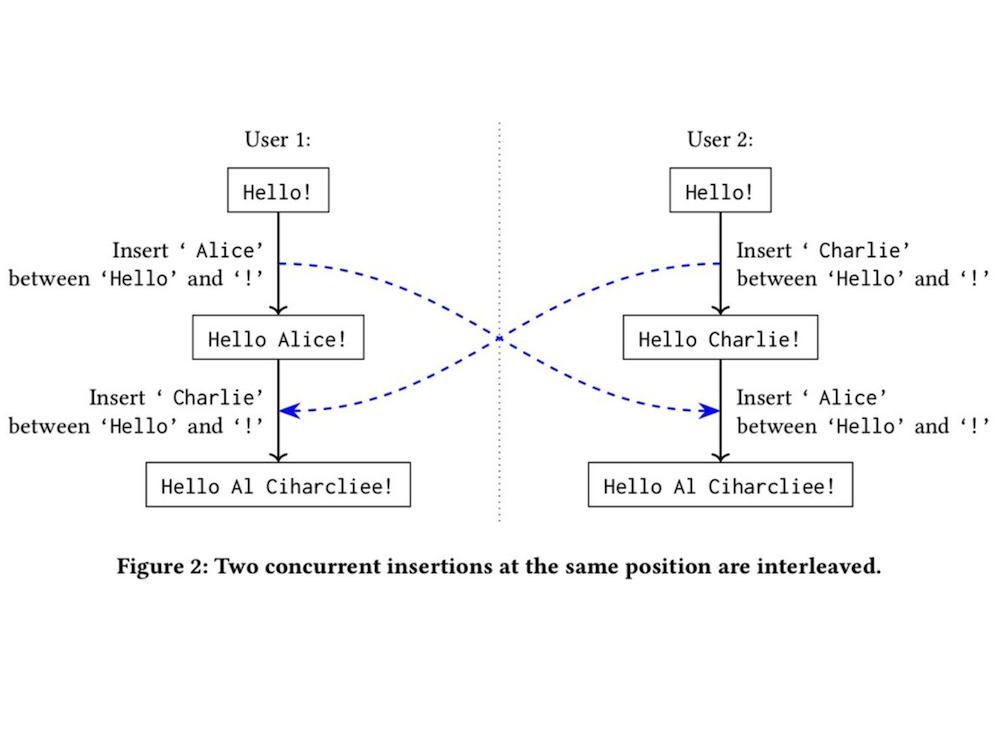
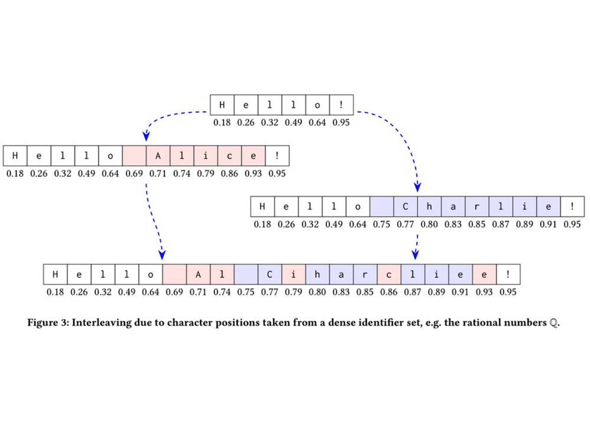

오늘은 Google Docs나 Notion, Figma에서 사용하는 동시 편집 기술에 대해 알아보겠습니다.

동시 편집 기술은 말 그대로 원격의 사람들이 같은 공간에서 동시에 편집할 수 있도록 해주는 기술입니다.

동시 편집 기술에 사용되는 알고리즘은 대표적으로 **CRDT**(Conflict-Free-Replicated Data Types)와 **OT**(Operational Transformation)가 있습니다.

## OT

먼저 OT 방식에 대해 알아보겠습니다.

OT 방식은 1989년~2006년 구시대에 사용된 알고리즘인데, 이 방식을 한 줄로 요약하면 **"서버가 병합을 수행"** 하는 알고리즘이라 할 수 있습니다.

### 예시

문자의 상태가 `HELO` 라고 해보겠습니다. 여기서

A가 3번째 인덱스에 `L`을 입력과 동시에,

B가 4번째 인덱스에 `!`를 입력했다고 가정하겠습니다.

- **원하는 목표: `HELLO!`**

그런데 서버에서 요청을 받기를 아래 순서로 받는다면 어떻게 될까요?

1. `HELO`
2. `HELLO` (A 사용자 입력)
3. `HELL!O` (B 사용자 입력)

이런 문제를 해결하기 위해선 B 사용자가 느낌표를 어디에 넣으려고 했는지 추측해서 **3번째 동작에 수정**을 줘야합니다.

OT를 수행하는 서버는 위 2번째 동작에서 문자열이 변경된걸 파악하고 B가 느낌표를 입력하려 했던 곳은 4번째 인덱스가 아니라 5번째 인덱스라고 추측합니다. 그리고 B가 보낸 입력을 변경해줘야 합니다.

> 여기서 변경해주는걸 transformation이라고 한다.
> 

### 단점

OT 방식은 **서버가 반드시 transformation 해줘야 하는 방식**으로 인해, P2P로 각각의 유저가 직접 연동하는 방식은 사용할 수 없다는 단점이 있습니다.

서버에서 모든 충돌을 해결해야 하기 때문에 사람이 몰릴 때 서버에 과부하가 올 수 밖에 없습니다.

## CRDT(Conflict-Free-Replicated Data Types)

CRDT는 이런 OT 방식의 문제를 해결하고자 나왔습니다.

중앙집중식 서버가 필요없고, 어떤 네트워크, 어떤 통신을 선택하던지 제한이 없도록 설계되었습니다. 그래서 협업 애플리케이션 뿐만 아니라 Redis Enterprise 같은 DC 간에 지역적으로 떨어져서 운영하는 DB 시스템에도 활용되고 있습니다.

CRDT를 한 줄로 요약하면 **"P2P 방식에, 교환법칙, (결합법칙)이 성립하는"** 알고리즘이라 할 수 있는데요,

OT 방식은 위에서 봤듯이 이전 동작에 따라 다음 동작이 transformation 되기 때문에 앞 동작이 뒷 동작에 영향을 미치므로 **교환 법칙이 성립할 수 없습니다.**

CRDT는 교환법칙이 성립하는데, 각 동작의 순서와 상관없이 변경 사항만 같으면 같은 상태로 봅니다.

### OT의 문제점 해결

OT 방식에서 문제점은 각 글자에 인덱스를 부여했다는 점입니다.

OT 방식은 배열 형식의 인덱스를 사용하면 인덱스가 변한다는 점이 문제였는데, CRDT는 이를 해결하기 위해 각 개체를 유니크한 값으로 간주합니다.

아까 봤던 예시를 CRDT 버전으로 다시 보겠습니다.

편의를 위해 원래 예시의 인덱스를 사용했습니다.

1. `HELO`
    | H | E | L | O |
    | --- | --- | --- | --- |
    | 0 | 1 | 2 | 3 |

2. `HELLO` (A 사용자 입력)
    | H | E | L | L | O |
    | --- | --- | --- | --- | --- |
    | 0 | 1 | 2 | 2.1234 (2와 3 사이의 난수) | 3 |

3. `HELLO!` (B 사용자 입력)
    | H | E | L | L | O | ! |
    | --- | --- | --- | --- | --- | --- |
    | 0 | 1 | 2 | 2.1234 | 3 | 3.5678 (3보다 큰 난수) |

OT 방식과 다르게 기존에 존재하던 글자들의 인덱스는 변하지 않기 때문에 어떤 순서로 변경사항이 들어와도 상관이 없습니다.

### CRDT 문제점

이런 CRDT도 문제가 하나 있는데, 같은 위치에 데이터를 삽입했을 때 merge하는 과정입니다.

위와 같이 난수를 사용하기 때문에 동시에 같은 부분이 수정되면 글자가 섞이는 문제도 있습니다.

이런 CRDT의 문제를 보완하기 위해 Yjs, Automerge 등 다양한 알고리즘 기법들이 나와있습니다.

이 알고리즘들에 대해서도 기회가 되면 다루도록 하겠습니다.

## 참고

[https://velog.io/@hbsps/CRDT-구현하기-CRDT란](https://velog.io/@hbsps/CRDT-%EA%B5%AC%ED%98%84%ED%95%98%EA%B8%B0-CRDT%EB%9E%80)

https://channel.io/ko/blog/crdt_vs_ot