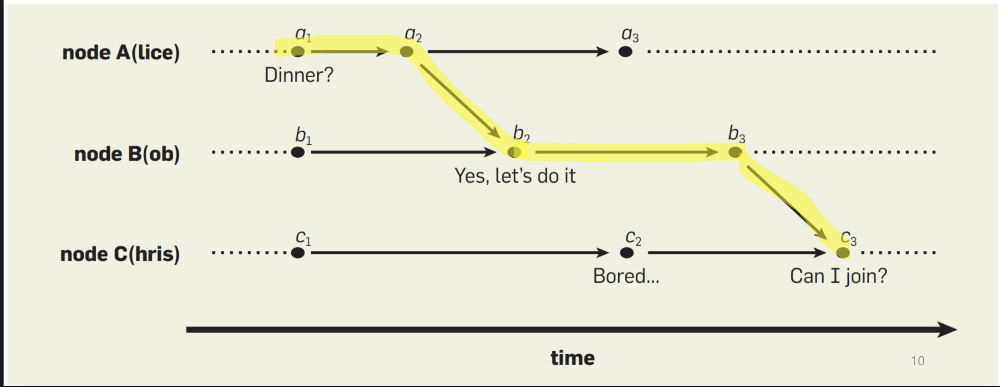

# logical clock

컴퓨터세계에서 로컬 timestamp는 썩 믿을만한 것이 못됩니다.

보통 대부분의 PC는 NTP라는 프로토콜을 이용해 시간을 동기화하고 사용하는데, 이는 네트워크를 이용해 시간을 동기화하는 것이므로 네트워크가 불안정하거나 끊겨있다면 실제 시간과 오차값이 커질 수도 있습니다.


때문에 분산 컴퓨팅에서 로컬의 timestamp를 믿고 개발을 진행하는 건 상당히 위험한데, 그래서 나온 것이 **Logical Clock**이라는 것입니다.

Logical Clock이 중요하게 생각하는 것은 각 이벤트가 "언제 발생했느냐"보단 **"A가 B보다 먼저 발생했느냐"** 를 중요하게 여깁니다.

즉 인과관계를 중요하게 여기는 것입니다.


그래서 위의 경우 a, b, c, d, f 끼리는 인과관계가 명확하게 주어지지만, a, b, c, d와 e 사이에는 무엇이 먼저인지 나중인지 알 수 없습니다.

## Lamport clocks

램포트라는 사람이 1978년에 발표한 알고리즘입니다.

이벤트간에 Partial ordering을 제공하고, 이벤트마다 Logical clock을 붙여줍니다.

```python
# 이벤트가 알려지면
time = time + 1;        # receiving
                        (message, time_stamp) = receive();
                        time = max(time_stamp, time) + 1;
# 이벤트 발생시
send(message, time)
```

Lamport Clock은 항상 아래를 만족합니다.

이벤트 a와 b가 인과관계에 있을 때 a의 Logical Clock <  b의 Logical Clock 입니다.

$$
if \ a → b \\
then \ C(a) < C(b)
$$

### 인과관계

인과관계에 있는 이벤트간에는 반드시 logical Time으로 대소비교가 가능합니다.



### 동시 이벤트


### 한계

하지만 Lamport Clock은 아래는 보장하지 못합니다.

$$
if \ C(a) < C(b) \\
then \ a → b
$$

### 쓰이는 예시

**4. 분산 로그 및 이벤트 추적 시스템**

Lamport Clock은 로그와 이벤트의 순서를 결정하는 데 유용합니다.

**예시**:

- 여러 서버에서 발생하는 로그를 중앙집중식으로 수집하고 분석합니다.
- 각 서버는 로그를 생성할 때 자신의 Lamport Clock 값을 포함시킵니다.
- 중앙 로그 수집 시스템은 로그를 수집할 때, Lamport Clock 값을 기준으로 로그의 순서를 정렬합니다.
- 이를 통해 시스템 전체의 이벤트 순서를 일관되게 유지할 수 있습니다.


예를 들어 위와 같이 로그가 쌓였다고 했을 때,

a와 h는 순서와 상관없이 섞여서 쌓이겠지만, h, b, c, e, j는 정확하게 순서대로 쌓일 수 있습니다.. (중간 중간 다른 것들은 순서가 섞여 있겠지만)

## 참고

https://www.youtube.com/watch?v=OKHIdpOAxto

https://www.youtube.com/watch?v=x-D8iFU1d-o

[https://drive.google.com/file/d/1wceo1cDpWtZr2Q-GJ8VuZDhQYTkciFKS/view](https://drive.google.com/file/d/1wceo1cDpWtZr2Q-GJ8VuZDhQYTkciFKS/view)

https://m.blog.naver.com/stallon72/10030817453