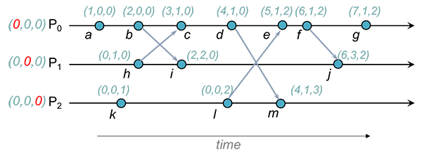

## conflict-free 하다는게 어떤걸까?

모호한 표현이지만, 간단하게 설명하면 "독점 쓰기"가 필요하지 않고 "결정론적인 자동 충돌 해결"을 수행할 수 있는 데이터 구조에서 동작한다고 할 수 있습니다.

충돌이 전혀 발생하지 않는다는 것은 아닙니다. 충돌이 발생해도 **구조 자체에 포함된 메타데이터**를 이용해 **충돌을 해결**하고 출력을 결정할 수 있다는 뜻입니다.

CRDT는 크게 state-based 와 op-based (operation) 방식으로 나뉘어지는데요,

- 상태기반 CRDT는 데이터 구조의 일부로 메타데이터를 넣는 경향이 있고,
- 명령기반 CRDT는 복제 프로토콜 자체에 메타데이터를 더 많이 넣는 경향이 있습니다.

## CRDT의 가장 중요한 "병합" 메서드

CRDT는 앞서 말했듯이 데이터의 일관성을 "독점 쓰기"가 아니라 **"결정론적인 자동 충돌 해결"** 을 통해 수행한다고 설명했습니다.

이 때 충돌이 발생하면 해결하는 과정을 병합이라고 부릅니다.

이 때 **병합 연산은 3가지 특성을 만족**해야 합니다.

1. 교환 법칙: A • B = B • A
2. 결합 법칙: (A • B) • C = A • (B • C)
3. 멱등성: A • A = A

> *여기서 • 연산은 미지의 병합 연산이라고 생각해주면 됩니다.*
> 

이 속성들을 모두 만족 시키기는 쉽지 않지만, **이 조건들을 만족 시키는 순간 얼마나 큰 효과를 얻을 수 있는지 지금 부터 알아보겠습니다.**

아래 두 가지는 위 조건을 만족하는 아래에서 사용할 예시입니다.

1. 두 집합의 합집합
2. 두 값의 max

## state-based

만약 상태를 기반으로 복제본을 맞춘다면, 연산을 끝낸 후 나의 데이터를 상대에게 보내면 됩니다.

2번 예시를 가져와 보면, A가 연산을 마쳤을 때 max 값이 5라면 본인의 값인 5를 다른 노드들에게 전달해주면 됩니다.

그럼 다른 노드들이 받은 데이터와 본인의 데이터를 max 연산하여 데이터 정합성을 맞출 수 있게 됩니다.

상태 기반 CRDT는 단순하지만 엔지니어링적으로 살펴보면 문제를 발견할 수 있는데요,

이번엔 1번 예시를 가져와서 A가 1000개의 요소가 있는 집합에 1개의 원소만 추가한다고 해보겠습니다.

그럼 A는 1001개의 모든 데이터를 다른 노드들에게 전달해줘야 해 매우 비효율적으로 동작하기 시작합니다.

이 문제를 해결하기 위해 나온 것이 delta-state-based 방식입니다.

delta-state-based 방식은 이후에 보도록 하고, 또 다른 예시로 Counter를 살펴보겠습니다.

### G-Counter (Growing-only Counter)

G-Counter는 증가연산만 있는 CRDT입니다.

카운터는 증가만 가능하기 때문에 "병합"과정에서 다른 노드와의 값 중에 큰 값을 취하는 식(max연산)으로 전략을 가져갈 수 있습니다.

1. `A: 4   B: 4` (동기화 상태)
2. `A: 6   B: 5` (동시에 A가 2 / B가 1 증가함) 
3. `A: 6 ↔ B: 5` (동기화 시작)
4. `A: 6   B: 6` (더 큰 값인 6으로 동기화)

max 연산은 3가지 법칙(교환, 결합, 멱등성)을 만족하기 때문에 G-Counter는 CRDT로 충분히 자격이 있습니다.

### Increment/decrement Counter

이번엔 증가뿐만 아니라 감소도 있는 카운터의 예시를 보겠습니다. (이를 **PNCounter** 라고 부르겠습니다.)

혹시 위의 G-Counter에 감소 연산만 넣으면 된다고 생각했다면 다시 생각해봐야 합니다.

감소를 할 수 있다는 전제가 들어가는 순간 병합 과정에서 최대값을 취하는 전략은 더 이상 옳지 않게 됩니다.

반례를 하나 들어보겠습니다.

1. `A: 5   B: 5` (동기화 상태)
2. `A: 4   B: 5` (A 감소) 
3. `A: 4 → B: 5` (동기화 시도. 하지만 B 값이 더 커서 무시)
4. `A: 4   B: 5` (정합성 깨짐)

그럼 어떻게 state-based CRDT에서 증감 카운터를 만들 수 있을까요?

바로 G-Counter를 두 개 사용하는 전략입니다.

G-Counter는 위 3가지 법칙(교환, 결합, 멱등성)을 만족하는 것을 확인했으므로 증감 카운터를 만드는데 문제가 없습니다.

사용자에게 보여줄 최종 value는 그저 G-Counter 두 개의 합을 보여주면 됩니다.

## Register

간단하게 값을 저장하는 register를 CRDT로 만들어보겠습니다.

그런데 변경에 대한 순서를 알 수 없다는 문제가 있는데요, 아래는 간단한 예시입니다.

1. `A: 5   B: 3` (A는 값을 5로, B는 값을 3으로 바꿨다)
2. `A → C, B → D` (A는 변경된 값을 C에게 먼저, B는 값을 D에게 먼저 보냈다)
3. `C: 5  D: 3` (C는 5, D는 3의 값을 가지게 됐다)
4. `A → D, B → C` (이제 A와 B가 나머지 노드에게 변경사항을 전달한다)
5. `C: 3   D: 5` (C는 3 D는 5를 가진채로 동기화가 끝났다)

### Logical Clock

우리는 앞서 계속 얘기할 때 이벤트가 일어난 순서, 즉 인과관계를 무시하고 있었습니다.

이제 여기에 이벤트의 인과관계라는 개념을 더할건데, 엔지니어링적으로 local의 timestamp를 사용할 순 없습니다.

이를 위해 우리는 분산 시스템에 대해 알아야 하는데 여기서 논할 주제는 아니므로 넘어가겠습니다. (간단하게 **여러 컴퓨터가 있는 현실세계**라고 생각하시면 됩니다.)

여러 컴퓨터가 있는 현실세계에서 timestamp를 왜 사용할 수 없을까요?

사실 컴퓨터의 시간은 절대적이지 않습니다. NTP라는 프로토콜을 통해 계속 오차를 맞춰나가는데 아쉽게도 완벽하게 정확한 시계는 없습니다.

그래서 실제로는 A 컴퓨터에서 먼저 발생한 이벤트가 B 컴퓨터에 도착했을 땐 나중에 발생한 이벤트처럼 보일 수 있습니다. (A 컴퓨터 시계가 B 컴퓨터 시계보다 빠를 때)

이를 해결하기 위해 나온 것이 Logical Clock입니다.

논리 시계는 인과관계를 표현하기 위한 시계로, 이벤트가 발생할 때 마다 단조증가 하는 시계입니다.

그 중 우리는 Vector Clock에 대해 알아보겠습니다.

### Vector Clock

Vector Clock은 Logical Clock의 종류 중 하나로, 각각의 노드가 본인만의 G-Counter를 가지고 있는 형태라고 보면 됩니다.

먼저 나의 노드에서 이벤트가 발생하면 나의 G-Counter 값을 올립니다.

Vector Clock은 아래와 같은 형상입니다.

Vector Clock에서 인과관계를 확인하는 법은 '모든 Vector 값이 더 크거나 같냐?' 입니다.

`b`와 `i`를 보겠습니다.

`b`와 `i`를 비교해보면 `i`가 모든 값에 대해 `b`보다 크거나 같기 때문에 명확히 `b` 다음에 `i`가 일어난 것을 알 수 있습니다.

그럼 `b`와 `h`는 어떨까요? 

둘은 비교할 수가 없는데요, P0값은 `b`가 더 큰데 P1 값은 `h`가 더 크기 때문에 누가 먼저 발생한건지 인과관계를 따질 수 없습니다.

이 상황에서 `i`로 합쳐지게 되면 CRDT 입장에선 이를 **"충돌"(중요)** 로 여깁니다.

**그럼 "병합" 과정이 일어나는 것입니다.**

### 다시 register로 돌아와서

아까 문제가 됐던 요청이 왔을 때 어떤 값을 선택할 것이냐?는 이제 vector clock으로 해결이 됩니다.

들어온 이벤트 중 vector clock이 높은 걸 기준으로 값을 가져가면 됩니다.

## 참고

[https://interjectedfuture.com/trade-offs-between-different-crdts/](https://interjectedfuture.com/trade-offs-between-different-crdts/)

[https://www.sciencedirect.com/science/article/abs/pii/S0743731517302332](https://www.sciencedirect.com/science/article/abs/pii/S0743731517302332)

[https://people.cs.rutgers.edu/~pxk/417/notes/clocks/index.html](https://people.cs.rutgers.edu/~pxk/417/notes/clocks/index.html)