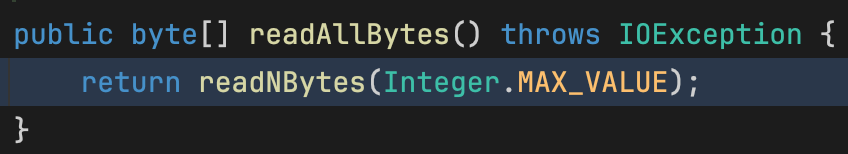

spring boot를 2에서 3으로 올리던 평화로운 어느 날이었습니다.
테스트를 진행하던 중에 http response의 body가 잘려서 내려오는 현상을 발견했습니다.
응답 결과가 실패가 아니라 성공인데도 response body만 잘리는 현상이 신기해서 조사했던 내용을 공유하고자 합니다.

## Content Encoding (gzip → brotli)
디버깅을 해봤더니 response의 content encoding 헤더가 우리에게 친숙한 `gzip`이 아니라 `br`이라는 인코딩 방식으로 내려오는걸 확인할 수 있었습니다.

그래서 request를 확인해봤더니, 기본 Accept-Encoding으로 `gzip`, `x-gzip`, `deflate`, `br` 총 4가지 인코딩 옵션이 요청헤더에 담겨져 있었습니다.

원인은 모르지만 `gzip이` 아니라 `brotli` 방식의 인코딩 방식을 사용하면서 문제가 생긴 것을 확인할 수 있었습니다.

> 버전업 전 request header의 Accept-Encoding은 gzip과 deflate만 존재했습니다.
> 
> 
> 
> 

## 해결방법

원인이 별로 궁금하지 않은 분들을 위해 해결 방법을 먼저 알려드리면, 간단하게 httpHeader를 overwrite 시켜주면 끝입니다.

## Response body가 잘리는 이유

response body가 잘리는 이유를 찾기 위해 디버거를 켰습니다.

디버깅하면서 로직을 분석하다보니 `BrotliInputStream`의 read 메서드가 예상과 다른 동작을 하고 있음을 발견했습니다.

고대의 유물인 `BrotliInputStream`은 destLen이 정확하게 buffer Size만큼 들어오길 기대하도록 짜여져있습니다.

만약 stream 내부적으로 계산했을 때 남은 buffer size가 3013인데 destLen이 8192로 남은 buffer size보다 크게 들어오면 **buffer의 데이터가 압축이 덜 풀린 것으로 인식**하고 buffer의 압축을 푸는 작업을 하도록 짜여져 있습니다.

그럼 왜 상위 메서드에서 `BrotliInputStream`의 read 메서드의 destLen 값으로 더 큰 값을 주었을까요?

`StringMessageConverter`의 readInternal 메서드를 보면 Content-Length 헤더가 따로 없다면 readAllBytes를 수행하도록 되어 있습니다.

readAllBytes는 length를 알 수 없기 때문에 `Integer.MAX` 값으로 넣어주도록 되어 있구요.

그래서 InputStream에서 bytes를 읽어올 때 InputStream 입장에선 정확히 남은 bytes를 모르므로 그냥 본인이 읽을 수 있는 DEFAULT_BUFFER_SIZE인 8192로 length를 넣어준 것입니다.

> InputStream.java
> 
> 

그래서 옛날 구현으로 되어 있는 `BrotliInputStream`은 압축 해제를 시도했지만, state가 이미 FINISHED 상태라 압축 해제를 진행하지 않았고 -1을 return 합니다.

> 추측: BrotliInputStream이 구현 될 당시엔 상위에서 정확하게 읽어야 할 byte를 계산해서 넣어줬을 것으로 예상됩니다.
> 

> 참고로 정상적인 압축 해제 과정은 response body가 있는지 확인하는 과정에서 진행됩니다. 이 과정에서 압축 해제가 완료되면 stream의 state가 FINISHED로 바뀝니다.
> 

-1을 return 받은 InputStream은 더 읽을 게 없다고 판단하고 stream 읽기를 종료해버립니다.

그래서 마지막에 남은 3013 bytes에 해당하는 response body가 잘렸던 것입니다.

## 왜 사용하지않던 brotli Encoding이 들어갔을까?

spring boot 버전업을 진행하면서 httpclient가 4 → 5로 버전업되었습니다.

그러면서 ContentCompression 로직에 broliSupported가 추가되었는데, 이게 true가 되면서 br이 포함되어서 내려가게 되었습니다.

brotliSupported는 단순히 BrotliInputStream 클래스가 있으면 사용 가능하다고 보고 있었는데요, brotli 관련 라이브러리를 추가한 적이 없었습니다. 어디서 추가된걸까요?

알고보니 `tika-parser`라는 라이브러리에 전이종속성으로 brotli 라이브러리가 포함되어서 들어온 것이었습니다.
