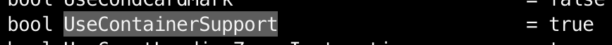
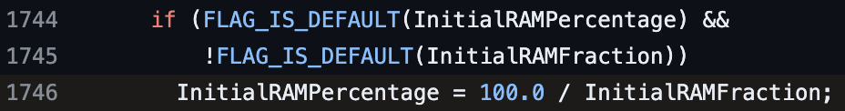
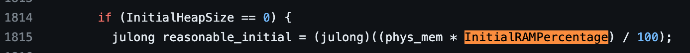
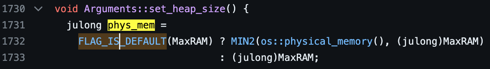
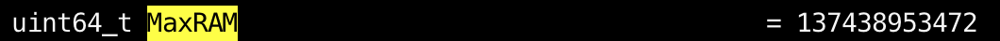
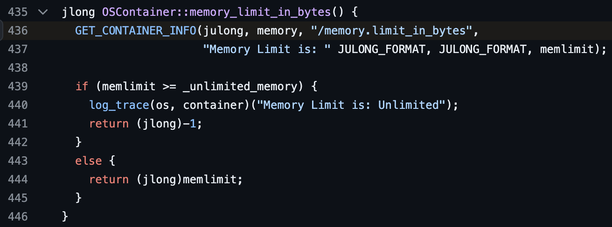
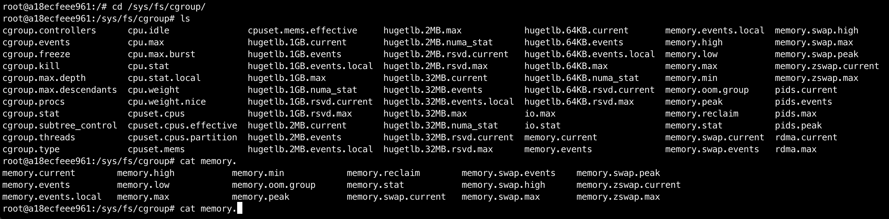
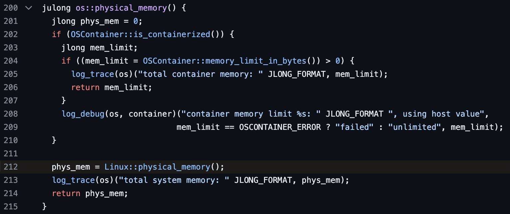
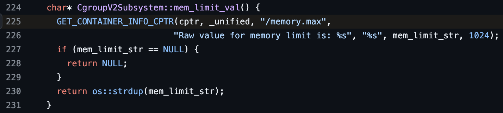

> 오늘은 jdk11+9 버전을 k8s에 올렸을 때 heap size 설정이 이상하게 되는 이슈에 대해 알아보겠습니다.

## InitialRAMPercentage, MaxRAMPercentage

k8s에 java 서버를 올릴 때 `InitialRAMPercentage`, `MaxRAMPercentage`로 java heap 크기 옵션을 주곤 합니다.

그럼 보통 기대하기로는 **컨테이너의 `resources.limit` 설정을 기준으로** 퍼센트가 산정되어 heap 크기가 결정될 것을 기대하는데요,

이번에 제가 겪은 이슈는 `resources.limit` 설정 기준이 아닌 **노드 전체의 메모리를 기준으로 heap 크기가 결정되는** 이슈였습니다.

## OOM

처음 이슈를 알게된 계기는 파드가 자꾸 OOM kill로 `CrashLoopBackOff`가 발생해서 였습니다.

처음엔 원인을 전혀 모르겠어서 `resources.limit`을 올리다 보니 어느 순간부터 파드가 뜨기 시작했고, jmx exporter로 메모리 사용량을 확인해보니 **노드의 전체 메모리 기준으로 heap 크기가 결정**되고 있었습니다.

### UseContainerSupport

처음 의심했던건 `UseContainerSupport` 옵션이었습니다.

하지만 jdk11부턴 아래와 같이 default가 true였기 때문에 해당 옵션은 문제가 아니었습니다.



## 코드 확인

일단 메모리를 가져오는 부분이 문제라고 판단을 했고, jdk11 코드를 직접 뒤지기 시작했습니다.



만약 `InitialRAMPercentage`가 default이고 `InitialRAMFraction`이 default가 아니면 `InitialRAMFraction`으로 계산하는, 레거시를 위한 코드가 존재하긴 했지만 `InitialRAMPercentage`를 직접 설정해주고 있는 저희에게 해당하는 경우는 아니었습니다.

[참고 링크](https://github.com/AdoptOpenJDK/openjdk-jdk11u/blob/jdk-11%2B9/src/hotspot/share/runtime/arguments.cpp#L1888)

### phys_mem

그러다 아래처럼 `InitialHeapSize`가 0이면 `phys_mem`이라는 값을 기준으로 `InitialRAMPercentage`와 계산을 해 메모리를 할당하는 부분을 발견했습니다.



> 여기서 `InitialHeapSize`는 흔히 아는 `-Xms` 옵션과 같은 옵션으로 JVM 힙 사이즈를 명시적으로 선언해주는 JVM 플래그입니다.

[참고 링크](https://github.com/AdoptOpenJDK/openjdk-jdk11u/blob/jdk-11%2B9/src/hotspot/share/runtime/arguments.cpp#L1957)

### os::physical_memory()

그럼 이제 이 `phys_mem`은 어디서 온 녀석인지 살펴봐야합니다.

아래 코드를 보시면 아시겠지만, `MaxRAM`이라는 값과 `os::physical_memory()` 값을 비교해 더 작은 값을 선택합니다.



그런데 `MaxRAM` 값은 아래와 같이 **default가 128GB**라 이것보다 크긴 어렵기 때문에 `os::physical_memory()`로 `phys_mem`이 할당됐다고 생각할 수 있습니다.



[참고 링크](https://github.com/AdoptOpenJDK/openjdk-jdk11u/blob/jdk-11%2B9/src/hotspot/share/runtime/arguments.cpp#L1873)

### memory.limit_in_bytes

코드를 여기 저기 더 살펴보다보면 `osContainer_linux.cpp` 파일에 `physical_memory`를 set하는 부분을 찾을 수 있습니다.

바로 `memoty_limit_in_bytes()`를 통해서 `physical memory`를 설정해주고 있는데요, `memory.limit_in_bytes` 파일은 cgroup에서 최대 사용자 메모리를 알려주는 파일입니다.



[참고 링크](https://github.com/AdoptOpenJDK/openjdk-jdk11u/blob/jdk-11%2B9/src/hotspot/os/linux/osContainer_linux.cpp#L436)

### cgroup v1과 v2

그럼 한 번 간단하게 docker의 ubuntu:latest를 받아서 `memory.limit_in_bytes` 파일을 한 번 살펴봅시다.

```shell
docker run -it --name ubuntu ubuntu /bin/bash
```

**놀랍게도 `memory.limit_in_bytes` 파일이 없습니다.** 뭔가 다른 이름이 있는걸까요?



범인은 바로 cgroup의 버전에 있는데요, cgroup이 v2로 올라오면서 `memory.limit_in_bytes` 파일이 없어지고 같은 역할을 하는 파일의 이름이 `memory.max`로 바뀐 것입니다. 

때문에 기존에 `memory.limit_in_bytes` 파일로 사용 가능 메모리를 계산하던 코드들과 최신 버전 컨테이너 OS에서 문제가 생기는 것이었습니다.

> 원인을 알고 나니 곳곳에 비슷한 문제로 곤욕을 겪고 있는 이슈들이 보이더라구요.
>
> https://github.com/docker/for-mac/issues/6118, 

### 그럼 왜 노드 전체의 메모리를 기준으로 설정이 됐을까?


앞서 봤던 위 코드에서 값을 찾을 수 없으면 `-1`을 반환하는 코드가 있는데, 때문에 아래처럼 `Linux::physical_memory`를 return하게 되는 것이었습니다.



[참고 링크](https://github.com/AdoptOpenJDK/openjdk-jdk11u/blob/jdk-11%2B9/src/hotspot/os/linux/os_linux.cpp#L212)

## 최신 k8s에서 jdk11 java heap 설정이 이상했던 이유

다시 본론으로 돌아오면, `jdk11+9`에서 java heap 설정이 이상했던 이유는 전체 메모리 계산을 할 때 `memory.limit_in_bytes` 파일을 찾을 수 없어 리눅스 전체 램을 기준으로 메모리를 산정했고, 전체 램을 기준으로 Percentage를 할당하다보니 생각했던 `resources.limits` 값 보다 큰 메모리가 할당되기도 했던 것입니다.

해결방법은 조금 허무하지만 최신 jdk 버전을 사용하면 됩니다.

jdk17만 봐도 `cgroupV2`에 대응한 코드가 있다는 것을 알 수 있습니다.



[참고 링크](https://github.com/AdoptOpenJDK/openjdk-jdk/blob/master/src/hotspot/os/linux/cgroupV2Subsystem_linux.cpp#L225)