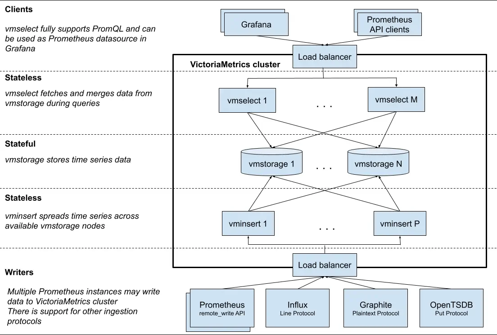
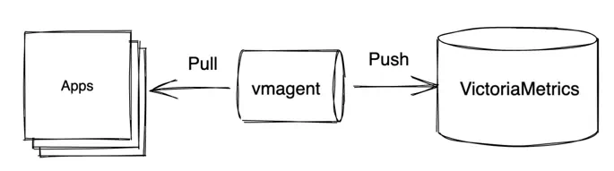
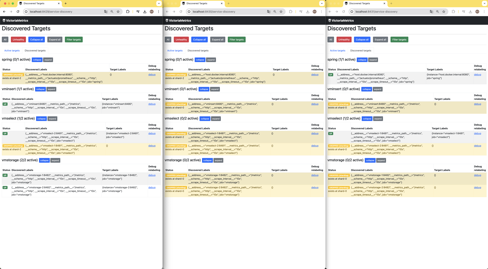
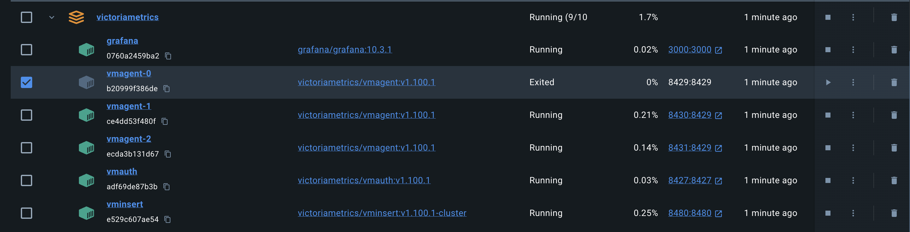
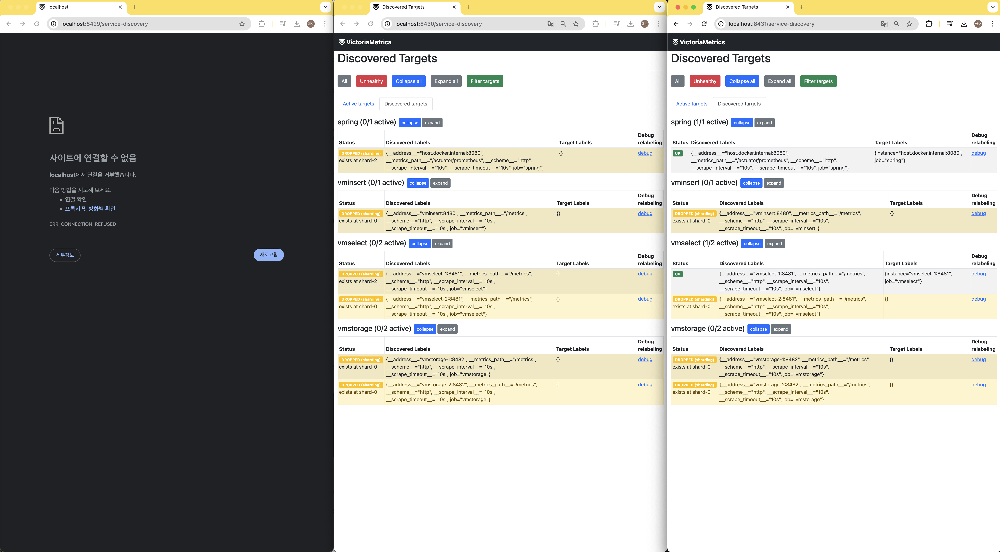
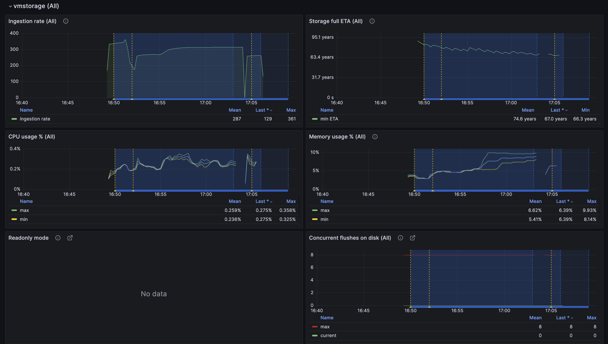
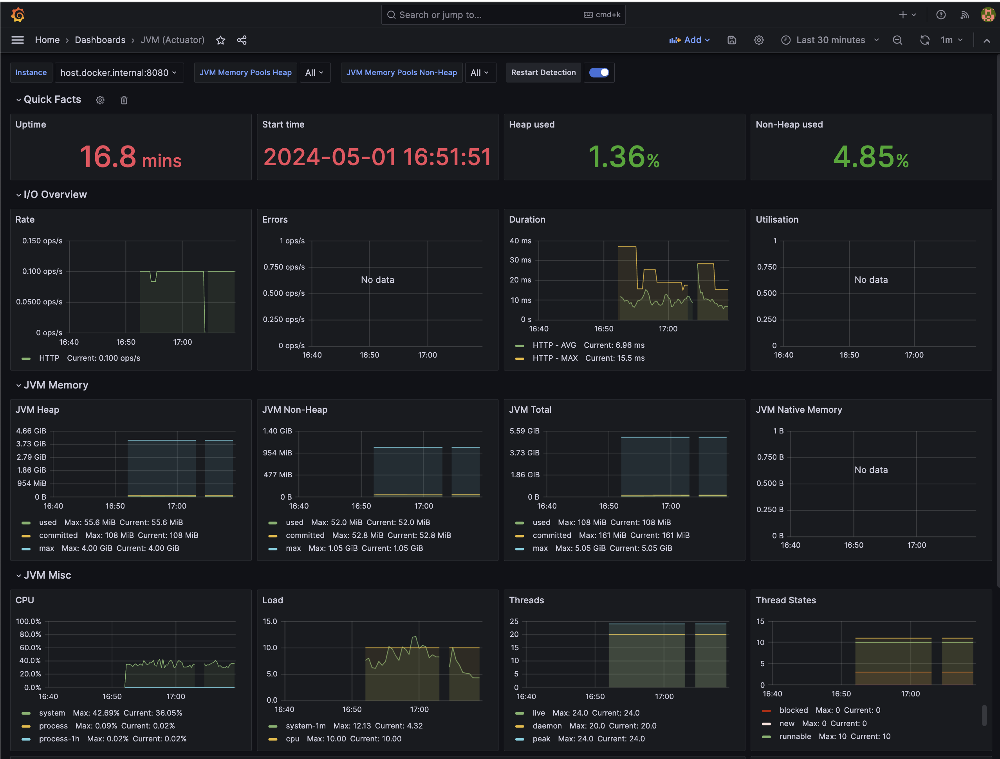
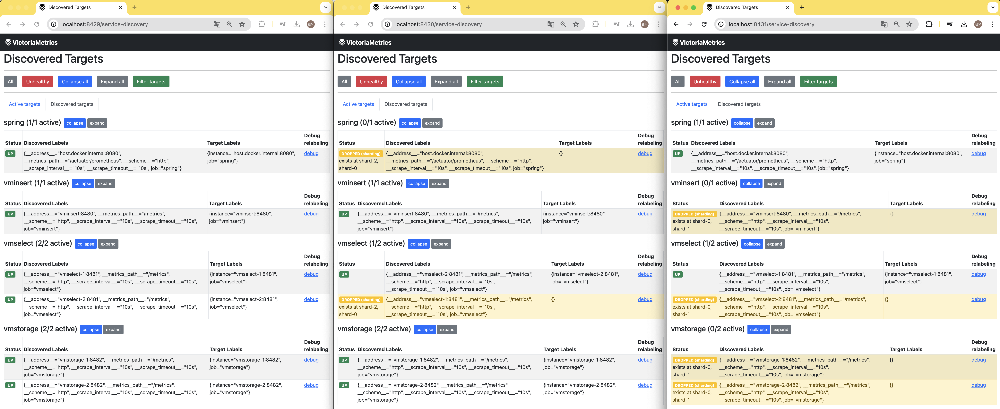

> 오늘은 VictoriaMetrics의 메트릭 수집기 vmagent에 대해 알아보겠습니다

# vmagent

vmagent는 **VictoriaMetrics**에서 만든 메트릭 수집기 입니다.

vmagent를 알려면 VictoriaMetrics에 대해 먼저 알아야 합니다.

## VictoriaMetrics

VictoriaMetrics는 시계열 DB 중 하나입니다.

대표적인 시계열 DB로 모두가 아는 prometheus가 있는데, VictoriaMetrics는 prometheus와의 호환을 중요하게 생각합니다.

PromQL을 지원함과 동시에 MetricsQL 이라는 자체 쿼리 언어도 만들어 조금 더 나은 성능을 보여주기도 합니다.

가장 큰 차이 2가지는 HA와 장기 보관 입니다.

1. Prometheus는 scale-out이 어려워 단일 실패 지점이 되는 반면 VictoriaMetrics는 Cluster 버전을 제공해 각각의 요소를 scale-out 할 수도 있습니다.
2. Prometheus는 설계상 장기 스토리지용이 아닙니다. 하지만 VictoriaMetrics는 장기 데이터를 저장하기 적합하고 심지어 공식 docs에서 prometheus의 장기 저장소로 사용해도 좋다고 가이드하고 있습니다. [https://docs.victoriametrics.com/single-server-victoriametrics/#prometheus-setup](https://docs.victoriametrics.com/single-server-victoriametrics/#prometheus-setup)

> naver D2의 최신 발표로도 VictoriaMetrics가 등장했었습니다.
>
> [https://d2.naver.com/helloworld/6867189](https://d2.naver.com/helloworld/6867189)

### VictoriaMetrics Cluster

VictoriaMetrics는 대용량 메트릭 수집을 위해 [클러스터 버전](https://docs.victoriametrics.com/cluster-victoriametrics/)을 제공합니다.

초당 100만개 이하의 데이터는 단일 노드 버전이 좋지만, 그 이상이 되면 클러스터 버전을 사용하길 권장하는데요, 클러스터 버전의 가장 큰 특징은 성능과 용량을 **수평적으로 확장**할 수 있다는 점입니다.

아래는 가장 대표적으로 VM Cluster를 표현하는 그림입니다.



크게 storage 역할을 하는 `VMStorage`, storage에 저장된 시계열 데이터를 가져오는 `VMSelect`, 그리고 데이터를 넣는 `VMInsert`로 구분됩니다.

이 중에 이번에 관심있는 파트는 `VMInsert`와 그 아래 `Writers`입니다.

`VMInsert`는 그림에서 알 수 있다시피 push 방식으로 메트릭을 집어넣어야 합니다.

> single node 버전에선 push 방식과 pull 방식을 모두 지원한다고 합니다.
>
> [https://docs.victoriametrics.com/quick-start/#write-data](https://docs.victoriametrics.com/quick-start/#write-data)


## vmagent

위에서 push 방식으로 데이터를 `VMInsert`에 넣어야 한다는 것을 알았습니다.

예상하셨다시피 vmagent의 역할은 데이터를 가져와 `VMInsert`에 데이터를 밀어넣어주는 역할을 합니다.

> 이 때 push는 prometheus의 remote WRITE API와 같은 스펙으로 값이 들어갑니다.
> 



### why vmagent?

사실 데이터를 scraping 하고 저장하는 기능은 prometheus에도 있습니다.

그럼 왜 굳이 vmagent를 사용해야 할까요?

1. 기본적으로 vmagent는 경량화 수집기로써 만들어졌기 때문에 prometheus에 비해 적은 CPU, RAM, 디스크 IO를 필요로 합니다.
2. 또 vmagent는 구성되어 있는 각 원격 스토리지에 대해 독립적인 디스크 지원 버퍼를 제공합니다.
    
    즉, 속도가 느리거나 일시적으로 사용할 수 없는 스토리지가 있어도 정상 스토리지로 데이터를 병렬로 전송하는 데 지장이 없는 반면 Prometheus는 구성된 모든 원격 스토리지 시스템에 대해 단일 공유 버퍼를 사용하기 때문에 한 곳에서 병목이 생기면 느려질 수 밖에 없습니다.
    
3. 무엇보다 vmagent는 많은 수의 대상을 스크래핑 하기 위해 scale-out을 지원합니다.
    
    아래와 같이 `-promscrape.cluster.membersCount` 옵션으로 vmagent의 수를 정해주고, 각 vmagent에 0~N-1 에 해당하는 고유 번호를 `-promscrape.cluster.memberNum` 옵션으로 주기만 하면 됩니다.
    
    ```bash
    /path/to/vmagent -promscrape.cluster.membersCount=2 -promscrape.cluster.memberNum=0 -promscrape.config=/path/to/config.yml ...
    /path/to/vmagent -promscrape.cluster.membersCount=2 -promscrape.cluster.memberNum=1 -promscrape.config=/path/to/config.yml ...
    ```
    

vmagent 3대를 띄워서 각각 memberNum을 1, 2, 3으로 주고 스크래핑을 해보겠습니다.



그럼 각각의 vmagent들이 서로 데이터를 나눠서 수집하는 것을 볼 수 있습니다.

vmagent가 수집하지 않는 메트릭의 Status가 노란색으로 `DROPPED (sharding)` 이 떠 있는걸 볼 수 있는데요, 이건 *'샤딩을 한 다른 vmagent가 수집해줄거야'* 라는 의미입니다.

여기서 만약 4개의 메트릭을 수집하던 vmagent-0가 죽으면 어떻게 될까요?



그냥 vmagent는 작동을 멈추고 다른 vmagent가 **그 일을 대신하진 않습니다.**

vmagent 끼리 서로의 존재를 모르기 때문에 어찌보면 당연한 결과입니다.



그래서 첫 번째 vmagent가 수집하던 vmstorage의 metric 정보 수집은 멈췄고,



두 번째 vmagent가 수집하던 application의 actuator metric은 잘 동작하는 것을 볼 수 있습니다.



### vmagent HA

위에서 생기는 SPOF 문제를 해결하기 위해 vmagent는 **HA**를 지원합니다.

vmagent는 HA 구성을 위해 여러 대의 vmagent가 하나의 메트릭을 중복해서 수집하도록 합니다.

여러 대의 vmagent가 같은 구성으로 scraping 대상을 바라보고 있다면 모두가 동시에 데이터를 수집해서 저장소에 push를 하기 때문에 **한 대가 고장나도 정상적으로 데이터를 수집할 수 있습니다.**

물론 같은 메트릭 데이터가 여러 vmagent에서 동시에 들어오기 때문에 **storage에선 데이터 중복 제거 옵션을 켜야만 합니다.**

예를 들어, membersCount=3 으로 vmagent를 3대 띄워놓고 `promscrape.cluster.replicationFactor` 옵션 값으로 2를 주면 2대의 vmagent에서 같은 target에 대해 메트릭을 수집하기 시작합니다.

그럼 한 번 실제로 시도해보겠습니다.

각각의 vmagent가 `replicationFactor=2`로 데이터를 수집하고 있는 모습입니다.

데이터 수집을 잘 분산해둬서 이 중 한 대가 죽어도 메트릭 수집은 멈추지 않는다는 것을 알 수 있습니다.



### 마무리

지금까지 vmagent의 매력적인 기능들을 알아봤습니다.

VictoriaMetrics는 `Go`로 되어 있는 오픈소스이기 때문에 관심있는 분들은 한 번 기여해보셔도 좋을 것 같습니다.

실습에 사용한 코드는 여기서 확인히실 수 있습니다. https://github.com/gusah009/VictoriaMetrics

## 참고

[https://docs.victoriametrics.com/vmagent/](https://docs.victoriametrics.com/vmagent/)

[https://medium.com/@seifeddinerajhi/victoriametrics-a-comprehensive-guide-comparing-it-to-prometheus-and-implementing-kubernetes-03eb8feb0cc2](https://medium.com/@seifeddinerajhi/victoriametrics-a-comprehensive-guide-comparing-it-to-prometheus-and-implementing-kubernetes-03eb8feb0cc2)

[https://docs.victoriametrics.com/faq/#what-is-the-difference-between-vmagent-and-prometheus](https://docs.victoriametrics.com/faq/#what-is-the-difference-between-vmagent-and-prometheus)

[https://docs.victoriametrics.com/faq/#what-is-the-difference-between-vmagent-and-prometheus-agent](https://docs.victoriametrics.com/faq/#what-is-the-difference-between-vmagent-and-prometheus-agent)