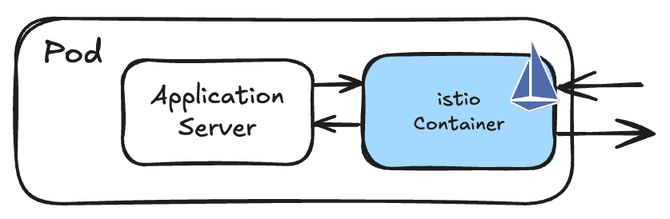
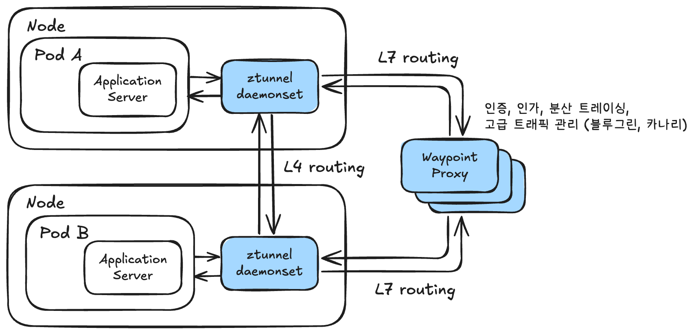
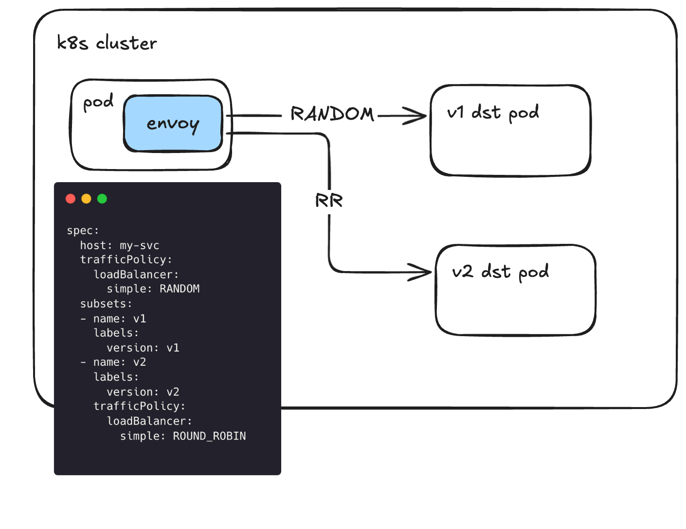
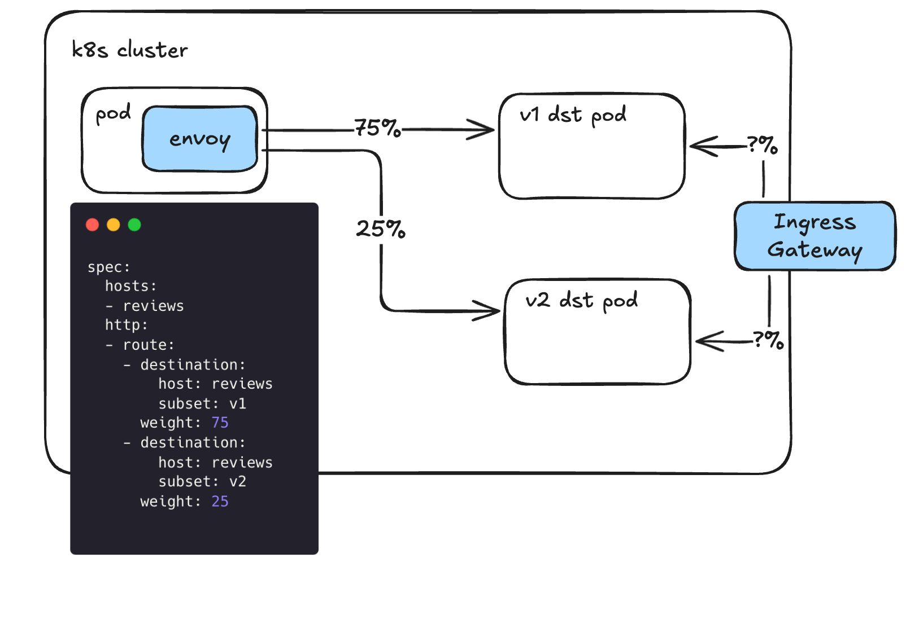
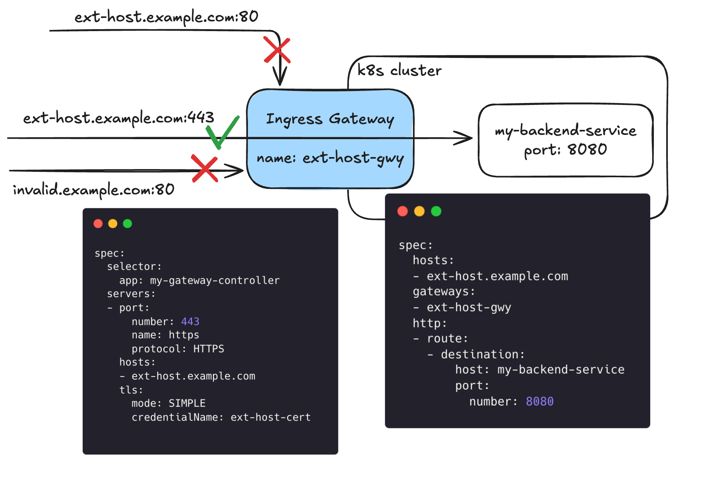

출처: [https://istio.io/latest/docs/](https://istio.io/latest/docs/)

# Why Istio?

## Envoy 사용

왜 istio를 사용해야 할까요?

첫번째 이유로는 Envoy를 사용한다는 점에 있습니다. Istio는 고성능 서비스 프록시인 Envoy를 주 프록시로 사용하는데, 실제로 Istio팀은 Envoy 오픈소스 최초의 외부 커미터였고 꾸준한 지원을 하고 있습니다.

## eBPF 사용

pod에서 프록시로 트래픽을 보낼 떄 eBPF를 사용할 수 있지 않을까?

- 실제로 istio에서 부분적으로 사용하는 곳도 있음. 그래서 iptables를 사용하는 것 보다 약간 성능이 향상됨.
- 하지만 안되는 것들이 꽤 많음.
- eBPF는 L3 라우팅이 가능하지만 복잡한 네트워크 구성이나 L7 라우팅은 안됨.

## CNI와의 차이점

> 이건 개인적으로 잘 와 닿진 않았습니다.
> 

CNI 플러그인이 일부 서비스 메시 기능을 제공할 수 있지만, **비표준적이고 기능이 제한적이며 특정 CNI에 종속**됩니다. 반면, **Istio는 표준을 준수하고, 강력하고 일관된 기능 세트를 제공하며, 어떤 환경과 CNI에서도 동작**합니다.

따라서, **보다 강력한 서비스 메시 기능, 보안, 유연성, 표준 준수를 위해 Istio를 사용하는 것이 좋습니다**. Istio는 마이크로서비스 환경에서 서비스 간 통신을 효과적으로 관리하고, 애플리케이션의 복잡성을 줄이며, 운영 효율성을 높일 수 있습니다.

# 방식

크게 사이드카 방식과 ambient 방식으로 나뉩니다.

- ambient 방식은 사이드카 방식에 단점을 느껴 만든 방식입니다.

## 사이드카



사이드카 방식은 모든 pod에 Envoy 프록시를 사이드카로 띄워서 pod로 향하는, pod에서 나오는 모든 트래픽을 envoy가 가로채 컨트롤 할 수 있게 하는 방식인데요, 2017년 첫 릴리즈부터 이 패턴으로 구축이 되었습니다.

하지만 모든 파드에 Envoy가 붙기 때문에 리소스 비용과 운영 오버헤드가 발생하는 단점이 있습니다.

## ambient 방식



2022년에 출시된 ambient 방식은 사이드카 방식의 단점을 보완하기 위해 나왔습니다.

모든 트래픽은 L4 노드 프록시를 통해 프록시되고 애플리케이션은 Envoy 프록시 라우팅 사용을 "선택하여" L7 기능을 사용할 지 말 지 결정 가능합니다.

## 둘 중 뭘 선택해야할까?

기본적으로 ambient(주변) 방식이 사이드카 방식의 단점을 보완하기 나온 것이기 때문에 대부분의 면에서 더 좋습니다.

|  | 사이드카 | 앰비언트 |
| --- | --- | --- |
| 자원 활용 | 모든 파드에 떠야해서 비효율적 | 필요한 만큼만 사용 가능하며 scale-out도 가능함 |
| 지연 시간 | 0.63ms-0.88ms | Ambient: 0.16ms-0.20ms<br>Waypoint: 0.40ms-0.50ms |
| 지원 | 멀티 클러스터 포함 지원 | Beta 버전, 단일 클러스터 지원 |

앰비언트 방식이 대체로 효율적이고 좋지만, 가장 치명적인 단점은 아직 beta 버전이라는 점입니다.

때문에 지원하지 않거나 부족한 기능들이 다소 존재합니다.

# 트래픽 관리

그래서 Istio를 사용해서 어떤 트래픽 관리를 할 수 있을까요?

istio를 사용하면 A/B 테스트, 카나리 배포, 백분율 기반 트래픽 분할은 기본이고, 서킷브레이커, timeout, 재시도 정책 같은 애플리케이션 서비스 레벨의 구성을 단순화 할 수 있습니다.

앞서 말했듯 istio의 트래픽 관리는 Envoy가 담당합니다.


## Virtual Service & Destination Rule

### Virtual Service

Virtual Service와 Destination Rule은 istio의 핵심 기능입니다.

Virtual Service는 Istio에서 제공하는 연결을 기반으로 라우팅하는 방법을 구성할 수 있습니다.

> 여기서 "Virtual"이라는 단어를 붙인 이유는 "추상적인 트래픽 관리 계층"이라는 의미를 포함하고 있기 때문입니다.

아래 예시를 보면서 설명하면 훨씬 빠르게 이해할 수 있습니다.

```yaml
apiVersion: networking.istio.io/v1
kind: VirtualService
metadata:
  name: reviews
spec:
  hosts:
  - reviews
  http:
  - match:
    - headers:
        end-user:
          exact: jason
    route:
    - destination:
        host: reviews
        subset: v2
  - route:
    - destination:
        host: reviews
        subset: v3
```

Virtual Service의 라우팅 규칙은 위에서부터 아래로 우선순위를 가집니다.

따라서 맨 위 규칙인 `headers의 end-user가 "jason"이면 reviews/v2로 트래픽을 보내라` 를 먼저 거치고 이게 아니라면, 남은 모든 트래픽을 `reviews/v3`로 보내는 것입니다.

이렇게 Virtual Service를 적용하면 모든 프록시(envoy)에 이 routing rule이 적용된다. 그럼에도 성능에 문제가 없는 이유는 Envoy에서 효율적인 라우팅 규칙을 사용하기 때문입니다.

- indexing 및 트리 구조 (요청의 호스트 검색이 빠름)
- Host 기반 룰 필터링 (호스트가 확인되면 관련 룰을 훑음)

이렇게 모든 프록시에 적용함으로서 룰을 중앙화 하지 않아 트래픽이 중앙 제어 장치로 한 번 더 거쳐 갈 필요가 없다는 장점도 생깁니다.

또, 아래처럼 weight을 주어 트래픽을 분배할 수도 있습니다.

```yaml
spec:
  hosts:
  - reviews
  http:
  - route:
    - destination:
        host: reviews
        subset: v1
      weight: 75
    - destination:
        host: reviews
        subset: v2
      weight: 25
```

### Destination Rule

다음으로 Destination Rule은 트래픽이 서비스에 도착했을 때, 어떻게 트래픽을 처리할 지 세부 동작을 결정하는 것입니다.

k8s를 예시로 들자면, 트래픽을 받은 svc가 여러 pod에 트래픽을 어떻게 분배할 지 결정하는 로직이라고 생각하시면 됩니다.

- 트래픽 분배 방식은 아래와 같이 다양하게 존재힙니다.
    - Random: 요청이 풀의 인스턴스로 임의로 전달됩니다.
    - Weighted: 요청은 특정 비율에 따라 풀의 인스턴스로 전달됩니다.
    - Round robin: 요청이 순서대로 각 인스턴스로 전달됩니다.
    - Consistent hash: HTTP 헤더, 쿠키 또는 기타 속성을 기반으로 소프트 세션 선호도를 제공합니다.
    - Ring hash: [Ketama 알고리즘을](https://www.metabrew.com/article/libketama-consistent-hashing-algo-memcached-clients) 사용하여 업스트림 호스트에 일관된 해시를 구현합니다.
    - Maglev: [Maglev 문서에](https://research.google/pubs/maglev-a-fast-and-reliable-software-network-load-balancer/) 설명된 대로 업스트림 호스트에 일관된 해싱을 구현합니다.
    

아래는 Destination Rule의 예시입니다.

```yaml
apiVersion: networking.istio.io/v1
kind: DestinationRule
metadata:
  name: my-destination-rule
spec:
  host: my-svc
  trafficPolicy:
    loadBalancer:
      simple: RANDOM
  subsets:
  - name: v1
    labels:
      version: v1
  - name: v2
    labels:
      version: v2
    trafficPolicy:
      loadBalancer:
        simple: ROUND_ROBIN
```

그림을 보면 알 수 있듯이 실제 트래픽 분배 방식을 결정하는건 Envoy입니다.



그럼 이런 의문이 들 수 있는데요. (저는 이런 의문이 들었습니다 ㅎㅎ...)

> src Envoy에서 트래픽 전달 방식(RR 같은)을 결정하면 각각의 src Envoy 프록시가 독립적으로 트래픽 분배를 결정하기 때문에 아래와 같은 문제가 생길 수 있지 않을까?
> 
> 1. 트래픽 5개가 podA로 들어오고, podA는 각각의 envoy에서 RR 방식을 사용하기 때문에 모두 podB1으로 트래픽을 보낸다.
>     
>     ```yaml
>     podA1 -> podB1
>     podA2 -> podB1
>     podA3 -> podB1
>     podA4 -> podB1
>     podA5 -> podB1
>     ```
>     
> 2. 다음으로 또 트래픽 5개가 들어오고, 모두 RR을 사용하기 때문에 다음 순서인 podB2에 모두 트래픽을 보낸다.
>     
>     ```yaml
>     podA1 -> podB2
>     podA2 -> podB2
>     podA3 -> podB2
>     podA4 -> podB2
>     podA5 -> podB2
>     ```
>     
> 
> 결국 RR이 제대로 동작하지 않게 된다.
> 

이런 문제는 src Envoy 프록시들이 각각 상태를 공유하지 않기 때문에 충분히 발생할 수 있는 일이라고 합니다.

그래서 Envoy에선 이런 문제를 해결하기 위해 `Randomized LB Seed` 같은 랜덤 시드로 동시에 한 파드에 몰리지 않게 하거나 `LEAST_REQUEST` 같은 방식(현재 연결 수가 가장 적은 Pod를 선택)으로 문제를 해결한다고 합니다.

## Gateways

지금까지는 클러스터 내부에서의 트래픽 흐름만 봤다면 이번엔 클러스터 외부에서 들어오는 트래픽에 대해 살펴볼 차례입니다.

지금까지 살펴본 방식이라면 아래 같은 경우엔 어떻게 될 지 궁금하실 수 있을텐데요.

분명 아까 전에 사이드카 방식은 보내는 쪽에서 Virtual Service를 적용해 weight을 분산시킨다고 했습니다.

그럼 Ingress Gateways로 들어오는 트래픽은 어떻게 weight을 조절할 수 있을까요?



Gateways는 클러스터 외부의 트래픽을 다루는 만큼 사이드카 Envoy 프록시가 아니라, 독립형 Envoy 프록시 형태로 사용됩니다.

여기서 Virtual Service와 헷갈릴 수 있는데, Gateway 리소스는 어떤 트래픽이 클러스터 내부로 들어오려 할 때, **"이 트래픽이 클러스터 내부로 들어올 수 있는지"** 에 대한 조건을 결정하는 리소스입니다.

예시를 보면서 확인해보겠습니다.

```yaml
apiVersion: networking.istio.io/v1
kind: Gateway
metadata:
  name: ext-host-gwy
spec:
  selector:
    app: my-gateway-controller
  servers:
  - port:
      number: 443
      name: https
      protocol: HTTPS
    hosts:
    - ext-host.example.com
    tls:
      mode: SIMPLE
      credentialName: ext-host-cert
```

Gateway에선 단순히 hosts와 port 등으로 방화벽 역할만 수행합니다.

위와 같이 Gateway 설정으로 들어온 트래픽이 어디로 향할지는 Virtual Service에서 결정합니다.

만약 아래와 같이 VirtualService를 설정하면 `ext-host-gwy` 라는 게이트웨이에서 들어온 `ext-host.example.com` 도메인을 가진 트래픽이 어떤 svc로 향하는지 알 수 있습니다.

```yaml
apiVersion: networking.istio.io/v1
kind: VirtualService
metadata:
  name: virtual-svc
spec:
  hosts:
  - ext-host.example.com
  gateways:
  - ext-host-gwy
  http:
  - route:
    - destination:
        host: my-backend-service
        port:
          number: 8080
```

위 내용을 그림으로 표현하면 아래와 같습니다.


