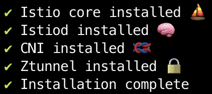
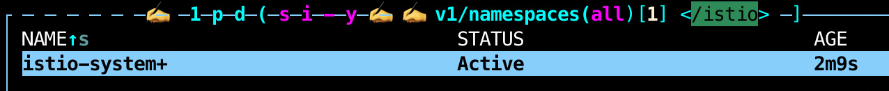
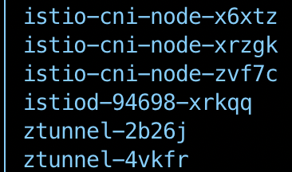
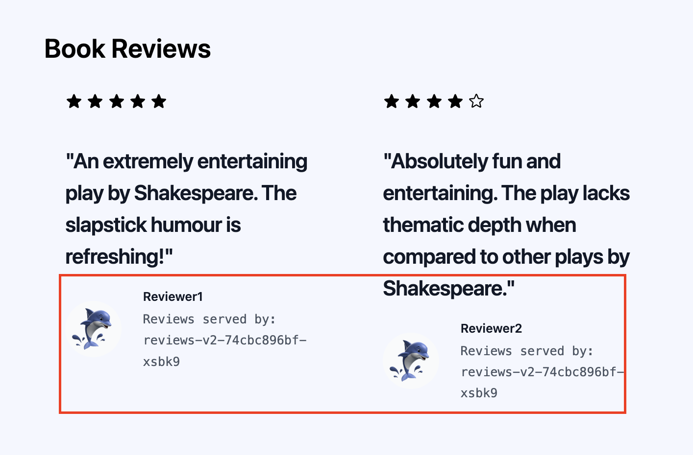
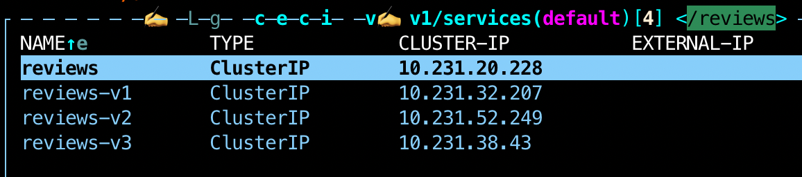
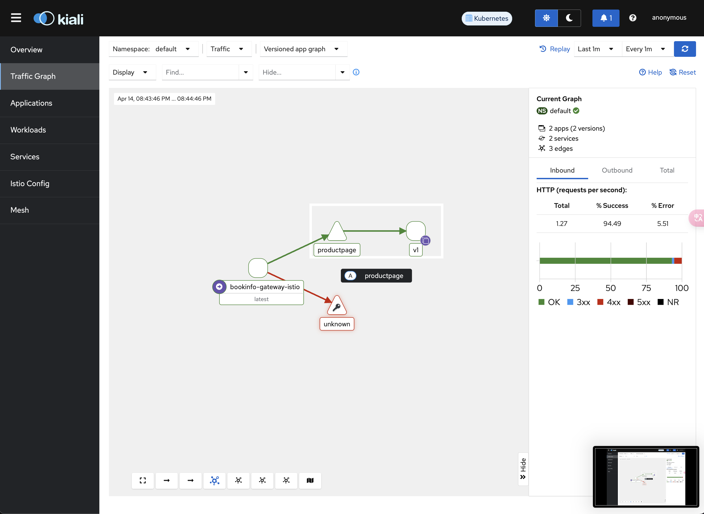
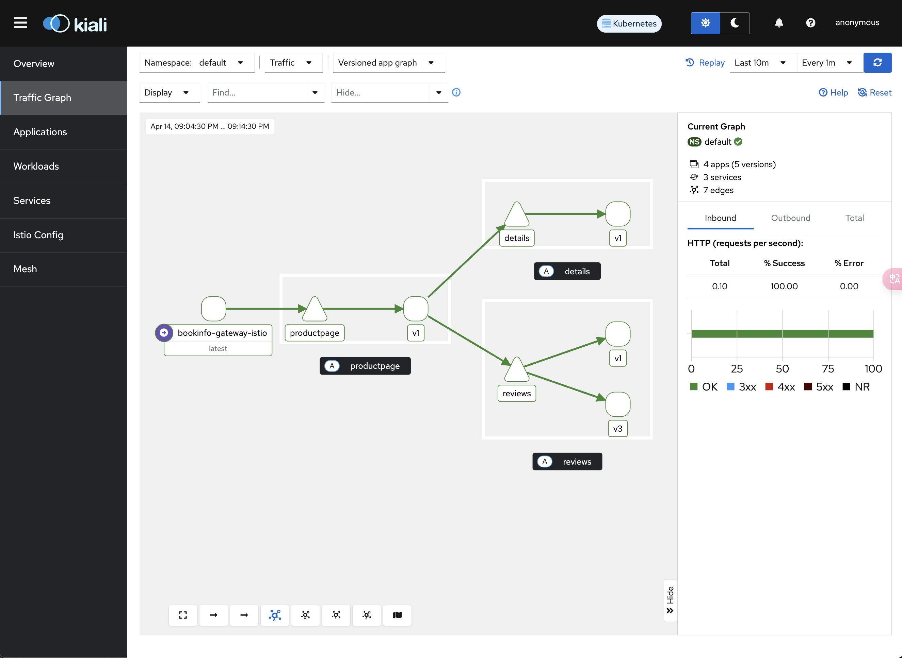

[Getting Started](https://istio.io/latest/docs/ambient/getting-started/)

```bash
curl -L https://istio.io/downloadIstio | sh -
cd istio-1.24.1
export PATH=$PWD/bin:$PATH
```

istio엔 kubectl같이 istio를 유용하게 사용할 수 있는 **`istioctl`** 이라는 명령어 도구를 제공합니다.

종종 사용할 수 있으니 미리 깔아두면 좋습니다.

## istio 설치

이번에 설치할 istio는 ambient 모드입니다. 

`--skip-confirmation` 옵션은 설치 과정에서 사용자 확인을 건너뛰는 옵션으로, linux에서 패키지 설치 시에 주는 `-y` 옵션과 비슷하다고 보면 됩니다.

```bash
istioctl install --set profile=ambient --skip-confirmation
```

여기를 보면 istio core도 설치됐고, CNI도 설치됐고 Ztunnel도 설치됐다고 나오네요.



istio-system이라는 namespace가 하나 생성되고, 그 안엔 `istio-cni`와 `istiod` 데몬, `ztunnel daemonset`이 떠 있는 것을 볼 수 있습니다.





### istio 설치

istio를 이용해서 우선 gateway 없이 istio를 설치하도록 합시다.

```bash
istioctl install -f [samples/bookinfo/demo-profile-no-gateways.yaml](https://raw.githubusercontent.com/istio/istio/release-1.25/samples/bookinfo/demo-profile-no-gateways.yaml) -y
```

그리고 namespace에 istio-injection=enabled를 추가해 이 namespace에서 파드가 뜰 때  자동으로 envoy 사이드카 프록시를 주입해주도록 해둡니다.

```bash
kubectl label namespace default istio-injection=enabled
```

### k8s Gateway API CRD 설치

> Kubernetes Gateway API는 쿠버네티스 클러스터에서 **트래픽 라우팅을 보다 유연하고 표준화된 방식으로 구성**할 수 있도록 설계된 API입니다. 기존의 Ingress API를 대체하거나 보완하는 역할을 하며, 특히 다음과 같은 특징이 있습니다:
> 
> - **더 정교한 트래픽 라우팅**: HTTP, TCP, gRPC 등 다양한 프로토콜에 대해 더 세밀한 라우팅 규칙을 설정할 수 있습니다.
> - **컨트롤러와의 유연한 통합**: Gateway API는 여러 네트워크 제공자(예: Istio, NGINX, Envoy 등)와 쉽게 통합되도록 설계되었습니다.
> - **추상화된 자원 모델**: Gateway, GatewayClass, HTTPRoute와 같은 리소스를 사용해 트래픽 라우팅을 정의합니다.

k8s Gateway API가 설치되어 있지 않다면 설치해줍니다.

```bash
kubectl get crd gateways.gateway.networking.k8s.io &> /dev/null || \
kubectl apply -f https://github.com/kubernetes-sigs/gateway-api/releases/download/v1.2.1/standard-install.yaml
```

### Deploy a sample application

다음으로 테스트에 사용할 응용 프로그램들을 설치합니다.

전체 구조는 아래와 같이 구성될 예정입니다.


블로그를 따라 구성하면 default namespace에 리소스들이 생깁니다.

다음으로 gateway를 배포합니다.

```yaml
apiVersion: gateway.networking.k8s.io/v1
kind: Gateway
metadata:
  name: bookinfo-gateway
spec:
  gatewayClassName: istio
  listeners:
  - name: http
    port: 80
    protocol: HTTP
    allowedRoutes:
      namespaces:
        from: Same # 같은 네임스페이스에 대해서만 라우팅!
---
apiVersion: gateway.networking.k8s.io/v1
kind: HTTPRoute
metadata:
  name: bookinfo
spec:
  parentRefs:
  - name: bookinfo-gateway
  rules:
  - matches:
    - path:
        type: Exact
        value: /productpage
    - path:
        type: PathPrefix
        value: /static
    - path:
        type: Exact
        value: /login
    - path:
        type: Exact
        value: /logout
    - path:
        type: PathPrefix
        value: /api/v1/products
    backendRefs:
    - name: productpage
      port: 9080
```

다음으로 gateway를 포트포워딩 한 뒤 [`http://localhost:8080/productpage`](http://localhost:8080/productpage) 에 접속해보면 아래와 같은 리뷰 창이 뜨는데, reviewer 파드는 서빙하는 주체에 따라 계속 바뀜을 알 수 있습니다.



이는 productPage가 reviews svc를 바라보고 있기 때문에 부하 분산을 자동으로 시켜주기 때문입니다.



## View the dashboard

istio는 여러가지 telemetry 애플리케이션들과 통합할 수 있습니다.

저희는 아래 4가지를 깔아보겠습니다.

- prometheus: 메트릭 수집 DB
- grafana: 메트릭 시각화
- Kiali 대시보드: 전체 지표 시각화
- Jaeger: end to end 분산 추적 시스템

istio-system namespace에 설치된 kiali 대시보드가 준비되면 포트포워딩으로 로컬에서 확인해봅니다.

kiali가 제공하는 많은 기능중 우선 눈을 즐겁게 하기 위해 Traffic Graph를 먼저 확인해보겠습니다.

> 추적 데이터를 확인하기 위해 아래 명령어로 트래픽을 생성해줍니다.
> 
> 
> `for i in $(seq 1 100); do curl -s -o /dev/null "http://$GATEWAY_URL/productpage"; done`
> 



그럼 위와 같이 보이게 되는데요, 4xx 에러는 제가 일부러 잘못된 포트로 트래픽을 보내 문제를 일으켜 보았습니다.

그럼 bookinfo-gateway-istio를 통해 트래픽이 들어오긴 했지만, 대시보드를 통해 알 수 없는 트래픽으로 들어왔음을 확인할 수 있습니다.



istio와 k8s gateway를 절차대로 정상적으로 설치했으면 위와 같이 보여야 합니다.

저는 깜빡하고 envoy 사이드카 프록시 세팅을 안해줬더라구요… 하하
