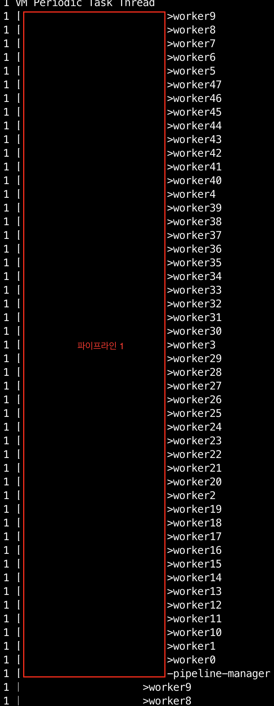
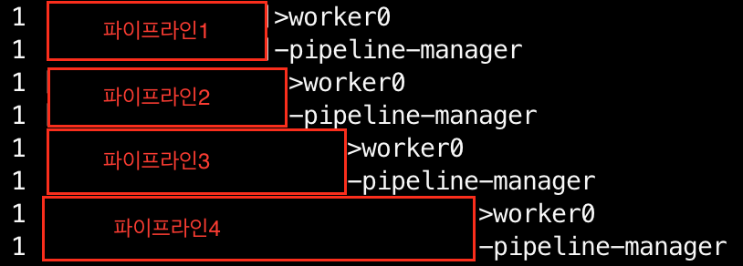

> 오늘은 jdk11을 사용하는 logstash에서 발생한 OOM 이슈를 트러블슈팅한 경험에 대해 공유하겠습니다

발단은 새로운 K8s 클러스터에 Logstash를 추가하면서부터였습니다.

새로운 클러스터로 옮기면서 파이프라인도 하나 추가했는데요, 갑자기 예상과 다르게 logstash가 OOM을 발생시키면서 **파드들이 모두 죽어나가기 시작했습니다.**

기존에 있던 memory limits (1.5Gi)를 풀고 확인해보니 **거의 3Gi를 차지하고 있었어요.**

기존 클러스터의 logstash에서 파이프라인을 단 하나 추가했을 뿐인데 메모리를 너무 많이 잡아먹는게 이상해서 조사를 해봤습니다.

> 기존 클러스터는 800Mi 정도 차지하고 있었어요.

## 1. 추가된 파이프라인 로직 의심

처음엔 당연히 추가된 파이프라인이 메모리를 아주 많이 사용하는 것으로 의심해 **파이프라인을 분석**해봤는데요.

filter에서 필드 하나만 replace 하는 파이프라인이라 딱히 이상할 게 없어 보였습니다.

## 2. 힙 오버플로우 의심

다음으로 의심한 건 힙 메모리의 GC가 안돌았다거나, 무한히 커지는 객체가 있을까였습니다.

그래서 heap dump를 떠서 IntelliJ로 확인해봤는데요, **특별히 용량이 매우 큰 객체가 보이질 않았습니다.**

여기서 정말 미궁에 빠졌는데요, 힙 메모리가 크지 않다면 **도대체 어디서 메모리를 차지**하고 있는걸까요? 

logstash가 아니라 서브 플러그인 같은 곳에서 메모리를 차지하고 있는데 잘못 짚고 있는 걸까 생각했습니다.

## 3. cgroup v2 의심

예전에도 사내에서 k8s 버전업을 진행하면서 [비슷한 이슈](https://gusah009.github.io/infra/2024-04-23-k8s%EC%97%90%EC%84%9C%20%EA%B5%AC%EB%B2%84%EC%A0%84%20jdk%EC%9D%98%20heap%20size%20%EC%84%A4%EC%A0%95%EC%9D%B4%20%EC%9D%B4%EC%83%81%ED%95%9C%20%EC%9D%B4%EC%8A%88/)를 트러블슈팅 했던 적이 있었는데요.

갑자기 그 이슈가 떠올라서 cgroup을 확인해보았습니다.

**예상대로** 기존에 사용하던 k8s 클러스터의 노드와 신규 클러스터 노드의 **cgroup 버전이 달랐습니다.**

> 노드의 cgroup 버전이 올라갔는데 JDK 버전이 이를 따라가지 못하면 새로운 cgroup의 cpu, memory 파일을 찾지 못하는 문제가 있습니다.
>
> 컨테이너의 최대 cpu, memory를 찾지 못한 컨테이너는 **노드 전체의 cpu, memory**를 사용하게 됩니다.
>

### 3-1. heap size 의심

처음엔 기존 이슈처럼 힙 메모리를 의심했습니다.

하지만 저희가 띄운 logstash는 힙 메모리를 퍼센티지가 아니라 `-Xms`, `-Xmx` 옵션으로 정확히 잡고 있었습니다.

JDK11 코드를 뒤져보면서 cgroup을 못찾으면 Xms, Xmx 설정을 무시하는 코드가 있지 않을까 **아무리 살펴봤지만 찾지 못했습니다.**

코드 분석을 잠시 멈추고 다시 원점으로 돌아갔습니다.

우선 진짜 힙 메모리를 정상적으로 사용중인지 확인하기 위해 **jcmd라는 툴을 이용해 메모리를 분석**해보았습니다.

```sh
-      Java Heap (reserved=524288KB, committed=524288KB)
       (mmap: reserved=524288KB, committed=524288KB)
```

확인해보니 Java Heap은 정상적으로 500MB를 할당해 사용중이었습니다.

### 3-2. 수상한 thread 사용량

그래도 메모리 분석을 통해 **의심스러운 부분을 하나 발견**할 수 있었는데, 바로 Thread 사용량이었습니다. (약 1.1G)

```sh
-      Thread (reserved=1138195KB, committed=151639KB)
       (thread #1103)
       (stack: reserved=1132900KB, committed=146344KB)
       (malloc=4016KB #6620)
       (arena=1279KB #2192)
```

정상적인 logstash라면 스레드 사용량은 아래와 같습니다.

```sh
-      Thread (reserved=270655KB, committed=28975KB)
       (thread #263)
       (stack: reserved=269396KB, committed=27716KB)
       (malloc=952KB #1580)
       (arena=307KB #525)
```

스레드 사용량에서 큰 차이가 나는걸 확인할 수 있었고, 이상함을 느껴서 jstack이라는 툴로 스레드 사용률을 확인해보았습니다.

```sh
./jstack 1 | grep '^"' | cut -d'"' -f2 | sort | uniq -c | sort -nr 
```



확인해보니 **worker 스레드의 개수가 거의 50**개로 비정상적으로 많은 부분을 확인할 수 있었습니다.



정상적인 logstash는 위와 같이 **파이프라인당 스레드를 2~3개** 정도만 사용중이어서 이상함을 느꼈고 logstash 코드를 뒤지기 시작했습니다.

logstash(7.17.5 버전) 코드를 뒤져서 확인해보니 `pipeline.workers`로 스레드를 설정하는 코드를 발견할 수 있었습니다.

https://github.com/elastic/logstash/blob/v7.17.5/logstash-core/lib/logstash/java_pipeline.rb#L92

저희의 경우 `pipeline.workers` 세팅을 안넣어주고 있었는데요, 그래서 default 옵션을 확인해보니 **default로는 사용 가능한 CPU를 모두 사용**하는 코드를 발견했습니다.

https://github.com/elastic/logstash/blob/v7.17.5/logstash-core/lib/logstash/environment.rb#L56

알고보니 cgroup 이슈로 저희가 설정한 CPU (1500Mi)를 찾을 수 없어 노드 전체 CPU(48core)로 사용 가능한 CPU를 잡아버렸고, **스레드 수도 사용 가능한 CPU 수 만큼 생겼던 것입니다.**

때문에 **스레드 수가 파이프라인당 거의 50개씩 추가되고 있어서 OOM**이 발생했던 것이었습니다.

## 해결

해결방법은 아주 간단한데요, pipeline.workers를 고정해주거나 logstash의 JDK 버전을 올려 cgroup v2를 지원해주도록 하면 됩니다.

이 트러블 슈팅은 해결방법보단 그 과정에서 의미가 있었는데요, [기존의 비슷한 이슈](https://gusah009.github.io/infra/2024-04-23-k8s%EC%97%90%EC%84%9C%20%EA%B5%AC%EB%B2%84%EC%A0%84%20jdk%EC%9D%98%20heap%20size%20%EC%84%A4%EC%A0%95%EC%9D%B4%20%EC%9D%B4%EC%83%81%ED%95%9C%20%EC%9D%B4%EC%8A%88/)를 먼저 깊게 파보지 않았다면 원인 파악을 위해 빙빙 돌았을 수도 있습니다. 

하지만 **기존에 문제를 깊게 파보고 원인을 명확히 했던 덕분에** 이번 이슈는 **꽤 빠른 시간에 원인을 확인**했다는 점에서 의미가 있다고 볼 수 있습니다.

