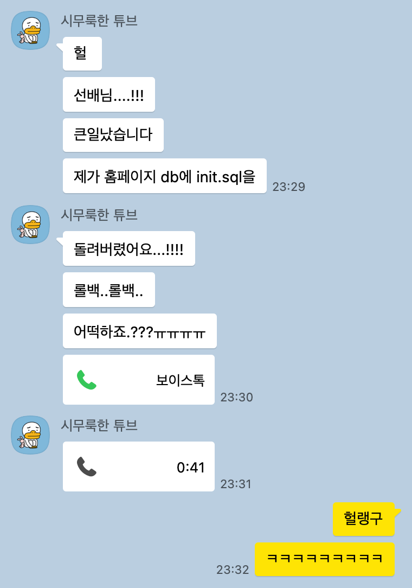
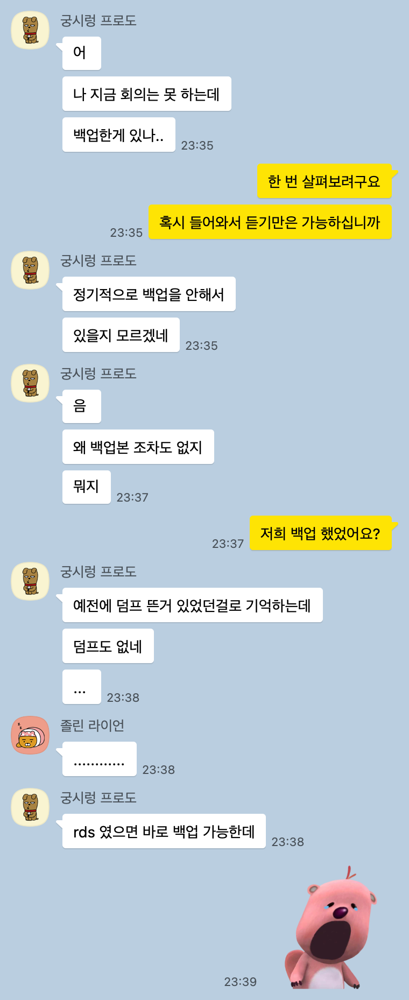
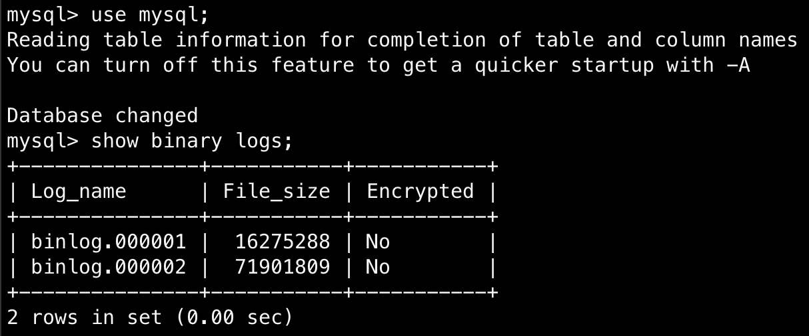
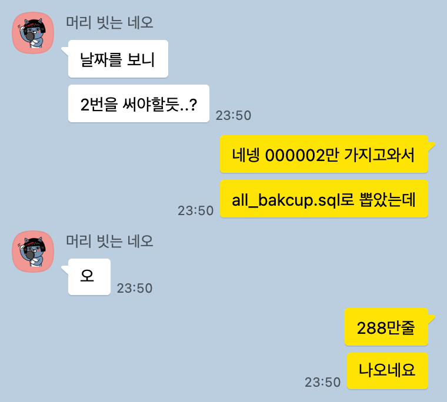
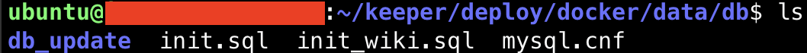
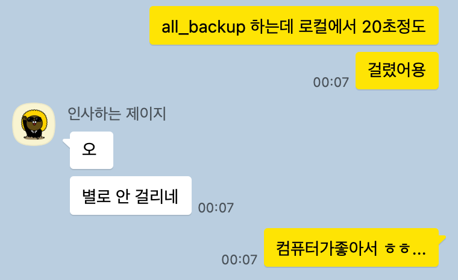
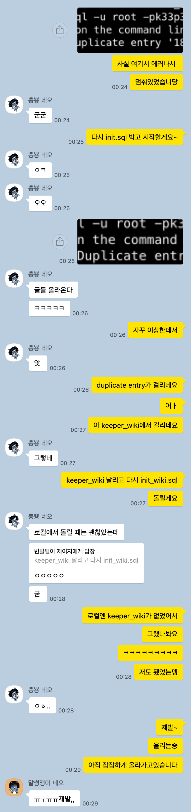
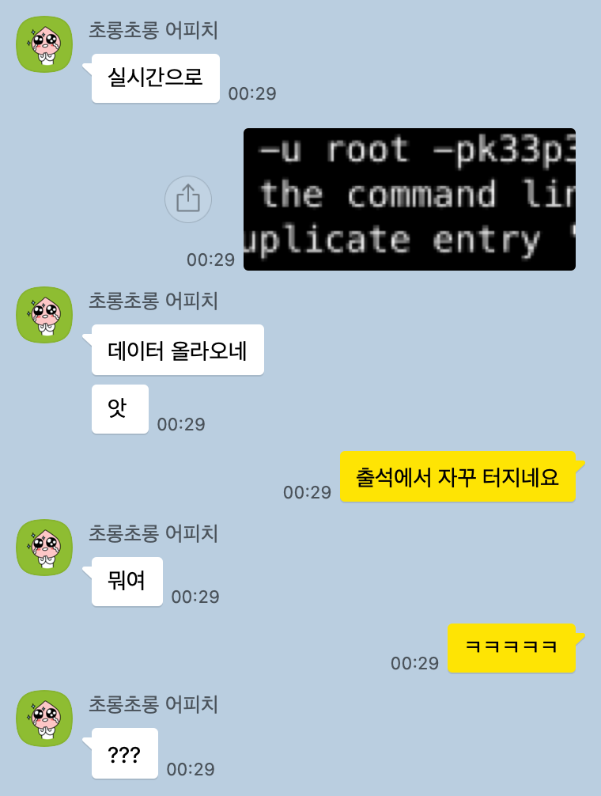
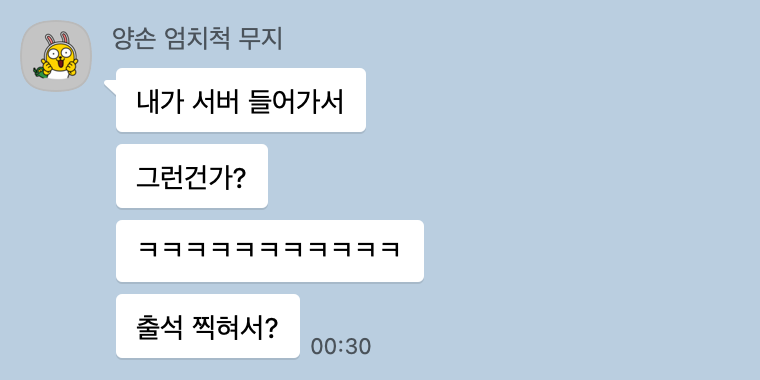
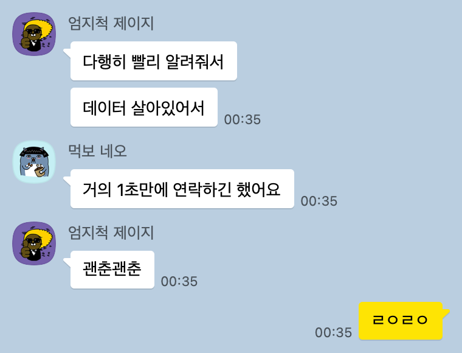

> DB가 날아갔다 !

평화롭게 롤토체스 유튜브를 보고있던 어느날 밤… 급하게 카톡이 왔습니다.

## 빠른 장애 복구

바로 키퍼에서 인프라를 담당하던 형님과 톡방을 파서 장애 복구에 나섰다.

DB가 모두 날아갔기 때문에 홈페이지는 로그인은 물론 아무것도 돌아가는게 없었는데…

심지어 백업본도 아무것도 없었다… 

갑자기 예전에 MySQL을 공부하다가 본 binlog가 떠올랐는데, 혹시나 이걸로 복구할 수 있지 않을까? 싶어서 바로 찾아봤다.

> *MySQL 의 빈로그 혹은 바이너리 로그는 MySQL 서버 인스턴스의 데이터 변경사항들에 대한 정보를 포함하는 로그 파일의 세트이다.*
> 
> 
> *여기에는 에러코드, 바이너리 로그 자체에 대한 메타데이터 등 다양한 데이터가 같이 포함되게 된다.*
> 
> *기본적으로 Transaction Commit 시에 기록되어지며, 데이터 변경 순서를 보장한다는 특징이 있다.*
> 

다행히 있다..! binlog가 저장되고 있었다.

### binlog 복구 시작

혹시 몰라서 

binlog를 로컬로 땡겨와서 백업을 시작했다…

굉장한 양의 backup sql 파일이 나왔다.

많아서 굉장한게 아니라 너무 작아서… 새삼 키퍼의 조촐한 트래픽을 느낄 수 있었다 🥲🥲🥲

## 이제 시작…

backup.sql 파일을 얻었다고 끝이 아니었다. 

binlog 파일은 **DB의 변경사항**에 대한 로그파일이기 때문에 변경 전의 데이터는 없기 때문이다.

- 변경 전의 데이터: 초기의 DB 테이블과 데이터들.
- **다른 서비스였으면 변경 전의 데이터 자체가 없었겠지만 우린 이미 한 번의 리뉴얼을 거치면서 리뉴얼 전의 데이터를 몽땅 이관해왔었다. 만약 이 데이터가 없다면 리뉴얼 전의 데이터는 복구가 안되는 셈…!**

하지만 우리의 **빛 인프라 개발자**… 이관 전 모든 `init.sql`, `init_wiki.sql` 파일을 모두 가지고 있었다!

### 로컬에서 시범 테스트

얼른 `init.sql`, `init_wiki.sql`, `binlog` 파일들을 몽땅 로컬로 가져와서 내 PC에서 테스트를 시작했다.

오..! 로컬에서 모든 데이터를 백업해봤더니 정상적으로 데이터가 들어있었다!

`backup.sql`도 모두 잘 동작했다… 이제 남은건 prod DB에 똑같이 실행해보는것..!

이제 남은건 기도뿐..!

## 또 한 번 실패

자꾸 이상한 곳에서 Duplicate entry 문제가 생기는게 아닌가..!

찬찬히 문제 로그를 살펴봤다.

attendance.. 출석에서 터진게 분명하다.

기가 막히게 원인을 찾아냈고, 백엔드 서버를 내리는 특단의 조치를 내렸다.

복구하면서 문제의 원인을 찾아봤더니 인프라 개발자님의 문제는 아니었고, 다른 친구가 홈페이지에 계속 들어와있어서 생긴 문제였다… ㅋㅋㅋ

다시 남은건 기도뿐…

## 복구 성공!

마침내 복구는 무사히 진행됐다..!

## 회고

제일 걱정이었던건 그 누구도 DB가 날아가는 장애를 경험해본적이 없다는 것이었는데, 역시 평소 공부가 중요하다는걸 느꼈다…

각자의 개인 역량으로 복구해내다니… 최고… 👍👍

---

어쩌다보니 1시간만에 장애 복구에 성공해냈지만, 모두 처음 가는 길에 두려움에 떨 수 밖에 없는 1시간이었다…

---

너무 다행이었던 점은 장애를 인지한지 1초만에 연락을 준 덕분에 빠르게 복구가 가능했다.

새삼 반성하게 됐는데, 만약 나였으면 시니어에게 바로 연락을 할 용기가 났을까…?

다시 한 번 우리 동아리 개발자들이 멋진 친구들이란걸 느끼게 됐다.

